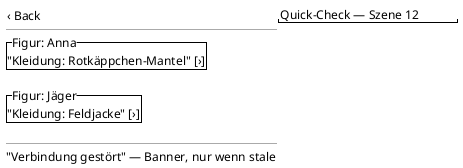

<!-- SPDX-License-Identifier: AGPL-3.0 -->
<!-- Copyright (C) 2024-2026 Breakdown RS Contributors -->
<!-- Co-authored-by: omen-alpha (opencode-go) -->

# Screen Specs — Template & Conventions

This directory holds the living screen specifications of the app: **one
Markdown file per screen** at `docs/design/screens/<screen-name>.md`
(kebab-case, matching the feature screen). Every screen spec follows the
template below.

**Lifecycle:** a screen spec is authored (or updated) in the *same
OpenSpec change* that implements the screen, and merged together with
the code. Specs live outside `openspec/changes/<change>/` because they
must survive the change's archive step (Decision D1 of
`establish-design-doc-workflow`). Updating the spec is part of every
screen change's review checklist.

**Language:** specs are written in English; user-facing UI copy is
German and is sourced from the glossary (`docs/design/glossary.md`) by
copy key.

---

## Rule box (normative)

> **Salt = static layout only.** PlantUML Salt wireframes in the Layout
> section document *static structure* — component arrangement, grouping,
> hierarchy. Behavior, states, timing, animation, and interactions live
> in this document's Markdown sections and in tests — **never inside a
> Salt diagram** (team decision 7 of the UI/UX research report, §8).
> Salt cannot express M3 interactions (bottom sheets, FAB floating,
> rail typography); encoding behavior in Salt produces misleading
> wireframes.
>
> **Platform neutrality.** Specs use generic Material 3 component
> vocabulary ("navigation bar", "extended FAB", "assist chip") — never
> Flutter widget names (`NavigationBar`, `FloatingActionButton`).
> Flutter-specific details are confined to the implementing change's
> task list and the code. The same spec must be able to seed Svelte,
> Slint, and GPUI implementations.
>
> **Every PlantUML block under `docs/design/` must compile.** CI runs
> `scripts/check-design-diagrams.sh` (PlantUML `-checkonly`); a block
> that does not parse fails the pipeline with file name and error
> output.

---

## Template

Copy the skeleton below into `docs/design/screens/<screen-name>.md` and
fill every section (an unfilled section states `N/A` with a reason, it
is not deleted).

```markdown
# <ScreenName> — Screen Spec

## Purpose & Context
<!-- 1–2 sentences: what the screen is for, who uses it, when. -->

## Navigation
<!-- How the user reaches the screen (tab / drill-down / modal),
     where they can go from here, back behavior, route parameters,
     and the AUTHZ-GATE that applies before any protected call. -->

## Layout
<!-- PlantUML Salt wireframe (fenced ```plantuml block, @startsalt…).
     Static structure only — see the rule box above.
     Provide a compact variant; add an expanded/adaptive variant when
     the screen differs across window-size classes. -->

## Components & Semantics
<!-- Table: Element → M3 component (generic vocabulary) → Semantics /
     meaning → Copy key (from docs/design/glossary.md). -->

## States
<!-- Loading / Empty / Data / Error / Stale / Optimistic — one row each;
     what the user sees and what state source drives it. -->

## Interactions
<!-- Actions the user can take, expected side effects (commands
     dispatched, projection refresh), debounce/cancellation rules.
     NO wireframe content — this section owns behavior. -->

## Input & Validation
<!-- If the screen has forms: fields, validation rules, problem-code →
     copy-key mapping for error display. Otherwise: N/A. -->

## Accessibility & i18n
<!-- Semantics labels, contrast requirements, visible-label compliance
     (glossary rule), copy keys instead of inline strings. -->

## Tests
<!-- Golden test names, widget-test keys, Gherkin tag if the screen is
     a designated critical flow (Soll/Ist report, continuity photo,
     costume assignment). -->
```

---

## Filled-in example (minimal)

A deliberately small example showing the template's tone and a Salt
wireframe in Layout. Full real-screen examples appear as the redesign
changes land their specs.

````markdown
# CostumeQuickCheck — Screen Spec

## Purpose & Context
Lets the costume department verify a character's assigned costume
directly before a take. Used on set, one-handed, short dwell time.

## Navigation
Reached from the Planen tab → Scene → character row. Back returns to
the scene. No route parameters beyond scene id. AUTHZ-GATE: costume
read requires an active membership; dispatch is gated client-side via
the membership check before any network call.

## Layout



## Components & Semantics
| Element | M3 component | Semantics | Copy key |
|---|---|---|---|
| App bar title | Top app bar | Screen identity | `quickcheck.title` |
| Character row | List item | Opens costume detail | `nav.characters` |
| Stale banner | Banner | Connection lost indicator | `errors.connectionLost` |

## States
Loading: list skeleton. Data: rows above. Empty: no characters in
scene → hint text `quickcheck.empty`. Error: Problem-Details code
routed per `code`, never per `detail` text. Stale: banner from the
cache-freshness flag.

## Interactions
Tapping a character row opens the costume detail. No destructive
actions on this screen. Pull-to-refresh reconciles projector lag.

## Input & Validation
N/A — read-only screen.

## Accessibility & i18n
Every navigation destination and primary action shows a visible label
(glossary rule); icons reinforce only. Rows announce figure + costume
via semantics. All copy via keys.

## Tests
Widget test: rows render from state; golden `costume_quickcheck_data`.
Err-branch test: error state renders per problem code.
````
