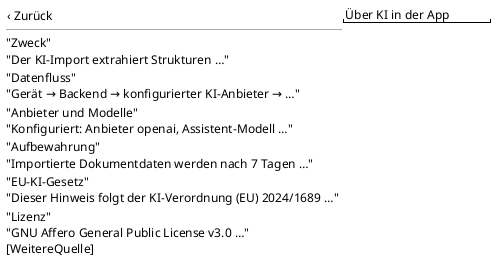

<!-- SPDX-License-Identifier: AGPL-3.0 -->
<!-- Copyright (C) 2024-2026 Breakdown RS Contributors -->
<!-- Co-authored-by: glm-5.3 (neuralwatt) -->

# AboutAI — Screen Spec

## Purpose & Context
The dedicated EU-AI-Act transparency disclosure (Art. 4/50, (EU)
2024/1689, issue #538): one permanent place that names what the AI import
is for, where data travels, which provider/models the deployment configured
(non-secret), how long document payloads are retained, that AI-derived
content is labelled and must be reviewed, and where the source lives.
Read-only; opened from the About dialog — not a settings surface.

## Navigation
Reached only through the About dialog's AI notice (the doorway — spec
`flutter-app-dialogs`: the notice remains AND navigates; tap closes the
dialog and pushes this screen over the app start context). Back pops back
to the screen below the dialog context. No route parameters. The naming
discovery read runs over the caller's AI vault configuration — no
season membership is required beyond the session that owns the config
(the same surface the AI-config screen protects server-side; the
read-only naming values are non-secret).

## Layout

Six stacked content blocks (icon surface + heading + body), each one M3
card; block (3) carries the configured naming line; block (6) carries the
source-repository affordance below its body.

## Components & Semantics
| Element | M3 component | Semantics | Copy key |
|---|---|---|---|
| App bar title | Top app bar | Screen identity | `aiDisclosureTitle` |
| Purpose block | Card + icon | What the feature is for | `aiDisclosurePurposeTitle` / `aiDisclosurePurposeBody` |
| Data-flow block | Card + icon | Device → backend → provider → drafts → preview → apply | `aiDisclosureFlowTitle` / `aiDisclosureFlowBody` |
| Naming block | Card + icon | Configured provider + assistant model (non-secret wire values); degradation copy when none/failure | `aiDisclosureNamingTitle` / `aiDisclosureNamingBodyConfigured({provider},{model})` / `…Unconfigured` |
| Retention block | Card + icon | 7-day payload GC | `aiDisclosureRetentionTitle` / `aiDisclosureRetentionBody` |
| EU AI Act block | Card + icon | Art. 4/50 reference | `aiDisclosureActTitle` / `aiDisclosureActBody` |
| License block | Card + icon + text affordance | AGPL-3.0 + source repository | `infoLicense` / `infoLicenseBody` / `infoSource` |
| Provenance badge (context) | Assist chip | Rendered on AI-derived rows in read surfaces (day list, day picker, Soll/Ist board, scene tiles) | `aiProvenanceBadge` |

## States
Data: all six blocks via static catalogs + the naming discovery result.
Loading (naming, transient): block (3) shows the honest loading note —
the block itself never blocks the disclosure visibility. Unconfigured:
block (3) shows the honest degradation copy — never an invented name.
Error (naming discovery): same degradation copy as unconfigured; the
other blocks stay available. Empty/Error (full screen): N/A — static
catalog copy always renders.

## Interactions
Tapping the source affordance opens the repository URL (platform browser;
failure surfaces the existing source-link notice). No commands are
dispatched, no debounces, nothing destructive. The naming discovery runs
once per entry (list-first config discovery — the same secret-free read
the config screen performs) and re-renders the naming line when it
resolves; the rest of the disclosure is static and immediate.

## Input & Validation
N/A — read-only disclosure; no forms, no problem-code routing (the only
branch is the naming state above).

## Accessibility & i18n
Every block heading renders as a visible label (glossary rule); icons
reinforce only. The badge copy is one catalog key shared by every read
surface so screen readers announce AI-derived rows uniformly. Tertiary
icon surfaces keep label/icon contrast per theme tokens. All copy via ARB
catalog keys (inline-copy gated).

## Tests
Widget tests: `ai_disclosure_screen_test.dart` — six-block presence,
configured naming (provider/model values, no secret material), honest
degradation (unconfigured + discovery failure), doorway push from
`info_dialog_test.dart`, goldens light/dark × android/macOS. Goldens:
`ai_disclosure_{light,dark}_{android,macos}.png`. Not a designated
Gherkin critical flow (disclosure is framing, not a business-critical
scenario); the wire contract gates live in the AI-import workflow tests.
