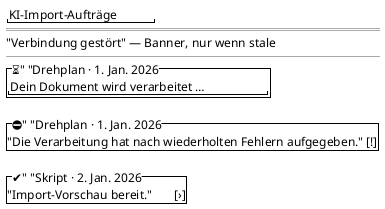

<!-- SPDX-License-Identifier: AGPL-3.0 -->
<!-- Copyright (C) 2024-2026 Breakdown RS Contributors -->
<!-- Co-authored-by: glm-5.3-flash (opencode-go) -->

# AI-Import-Aufträge (ai-import-jobs) — Screen Spec

## Purpose & Context

The persistent "what did I import" surface (issue #547): every AI-import
job the user started stays reachable after leaving the job-status screen.
It closes the silent dead-letter hole — a job that ends in
`dead_letter` or `payload_unavailable` after the user navigated away was
previously unlearnable. The list renders the caller's jobs newest-first
from the cache-then-revalidate `aiImportJobsView` projection.

## Navigation

Reached from the **Planen** tab two ways: the active-jobs summary row
(shown while any known job needs attention) and, from the jobs screen's
empty state, the CTA into the import entry. Row selection pushes the job
status screen (`AiJobStatusScreen`) — the screen that owns the single
foreground status watch; back returns to the list. No route parameters.
AUTHZ-GATE: the jobs list route is ownership-scoped server-side; the
client resolves the authenticated session before the fetch (no session →
no request) and denials surface through code-keyed copy
(`jobWatchForbidden` / `aiJobsLoadError`), never backend `detail`. The
sibling Planen import entry keeps its block-scope gate — this screen does
not weaken it (it dispatches no block-scoped write).

## Layout

Expanded (window width class ≥ medium): the same single-column list
constrained to a content max-width with wider gutters — a jobs list never
splits into master/detail panes; the detail surface is the pushed status
screen, on every window size.

## Components & Semantics

| Element | M3 component | Semantics | Copy key |
|---|---|---|---|
| Screen title | Top app bar | Screen identity (plural) | `aiJobsTitle` |
| Job row | List item | Pushes the job status screen (the single-watch owner) | row key |
| Row title | Text | Document kind + created date, e.g. „Drehplan · 1. Jan. 2026" | `aiJobsRowSubtitle` |
| Row status | Text | One of the six honest status copies, always visible next to the icon | `aiImport.jobStatus` |
| Status icon | Icon | Per-status glyph (see glossary); error-colored for terminal failures — reinforcement only, never the sole carrier | status glyphs |
| Retry budget | Text | Retryable `failed` rows show `Versuch {retries} von {maxRetries}` | `aiJobRetryBudget` |
| Last-error indicator | Icon | Presence indicator on rows carrying a server error detail; the raw text renders only on the status screen, as secondary detail | status glyph |
| Stale banner | Banner | Failed refetch serving retained cached rows | `seasonsStaleBanner` |
| Error state | Card + button | Copy keyed on the problem `code`; retry re-runs the list route | `aiJobsLoadError` / `aiJobCheckAgain` |
| Empty state | Icon + text + button | Honest "no import yet" + CTA into the import entry | `aiJobsEmpty` / `aiJobsEmptyCta` |
| Planen summary row | List item | Visible while any known job needs attention (any non-`succeeded` status) | `planningActiveJobRow` / `aiJobsActiveBadge` |

## States

Loading: skeleton rows (visible only before the very first cache seed —
the cached-first paint makes cold starts render rows immediately). Data:
newest-first rows. Empty: honest "no import yet" with the import CTA.
Error: full error state when no rows are retained; a banner above the
retained rows otherwise — both keyed on the stable problem `code`, never
`detail`. Stale: the shared cache-staleness banner when a failed refetch
left only cached rows. There is NO optimistic layer: this boundary
dispatches no commands.

## Interactions

Row tap pushes the job status screen, which arms the single foreground
watch (D5) and owns the re-arm (`aiJobCheckAgain`) and preview
(`aiJobReviewPreview`) affordances; leaving it disposes the watch. The
list itself arms NO watch and dispatches nothing — pull-to-refresh
re-runs exactly the list route, which is the status authority for rows;
there is no per-row polling and no fabricated progress indicator (the
wire carries `retries`/`max_retries`, never a percentage). The Planen
summary row pushes this screen and never arms a watch.

## Input & Validation

N/A — read-only screen (no forms, no commands).

## Accessibility & i18n

Every row renders its meaning as visible text (kind, date, status, retry
budget); icons reinforce only and terminal failures additionally use the
error color, so color is never the sole carrier either. All copy via the
ARB catalogs (`aiJobs*`, `jobStatus*`, `jobWatch*`, `aiJobRetryBudget`); 
backend `detail` text never renders on this screen. Row semantics announce
kind + date + status.

## Tests

Widget tests: rows render kind + date + status text + icon; tap pushes the
status screen (watch-call proof: zero before the tap); empty state + CTA;
error state per `code`; stale banner over retained rows; terminal-failure
distinctness; Planen summary row visible/hidden matrix and navigation.
Unit tests: cache-then-revalidate ordering, no-watch assertion (D5),
remembered-id fast-path seed ordering, `forgetJob` reconciliation, status
label matrix (all six), code-keyed error copy. Goldens:
`ai_jobs_light_android`, `ai_jobs_dark_android`, `ai_jobs_light_macos`,
`ai_jobs_dark_macos`. Tier-4 integration is deliberately not added (the
tier-2 tests cover the return path with a mocked API; recorded decision).
