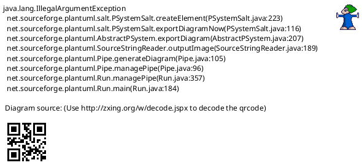

<!-- SPDX-License-Identifier: AGPL-3.0 -->
<!-- Copyright (C) 2024-2026 Breakdown RS Contributors -->
<!-- Co-authored-by: space-bunny (opencode-go) -->

# Cast View — Screen Spec

> **Status: Soll.** Authored in the `three-view-navigation-shell` OpenSpec
> change (issue #610): the costume surface and the costume-category
> vocabulary moved into the actor roster, replacing the dissolved „Kleidung"
> destination and the categories entry of the dissolved „Mehr" destination.

## Purpose & Context
The Cast view answers „who is in this season, and what do they wear?" — the
actor roster (Figuren) with their contacts and measurements, and the
season's costumes with their assignment and photos. Used by the costume and
production departments throughout the shoot, mostly as a lookup surface.

## Navigation
Reached as navigation destination 1 of 3 (selected on app start); never
pushed. Tapping a character row opens the character detail, a costume row
the inline costume editor (both unchanged, on this destination's nested
navigator). The app-bar action opens the season-scoped costume-category
vocabulary; the profile action opens the identity/about/settings/sign-out
sheet. With no active season the view shows a season-selection empty state
whose CTA opens the season scope picker — there is no Season destination to
jump to any more. AUTHZ-GATE: the costume and character writes keep their
client-side membership checks before any network call (unchanged); this view
adds no call of its own.

## Location & Context
The shell renders the location strip and the season + block scope chips
above this view. This screen contributes no hierarchy level of its own: it
is a destination ROOT, so the strip stays hidden here and appears as soon as
a hierarchy screen is pushed on the destination's navigator. The active
season arrives as plain data from the shell state (never re-resolved here).

## Layout

Static structure only: the switch has exactly two halves (roster, costumes);
which half is active, the season scoping and the empty states are described
in Interactions and States.

## Components & Semantics
| Element | M3 component | Semantics | Copy key |
|---|---|---|---|
| View title | Top app bar | The destination's own title | `navCast` |
| Roster/costume switch | Segmented button | Two labeled segments, both labels always visible | `castSegmentCharacters` / `castSegmentCostumes` |
| Costume categories action | Icon button with tooltip | Opens the season-scoped category vocabulary; never offered with no season scope | `castCategoriesTooltip` |
| Profile action | Icon button with tooltip | Identity, Über die App, Einstellungen, Abmelden | `profileTooltip` |
| Season-empty state | List with CTA | „Wähle eine Season, um Kostüme und Figuren zu sehen." + „Season wählen" | `castNoSeason` / `castPickSeason` |
| Roster / costume list | List (hosted screen) | Unchanged `CharactersScreen` / `CostumesScreen` content | — |

## States
Loading/error/empty/stale/optimistic: owned by the hosted roster and costume
screens (unchanged). View-level empty: no active season → season-selection
state (never an error). Stale scope: a season chip for another season is
never rendered as if it applied (the block chip's foreign-season narrative).

## Interactions
Switching between the two halves is local view state (not navigation
history): the roster and the costume list each keep their own scroll and
overlay state for as long as the destination stays alive. The categories
action pushes the vocabulary on this destination's navigator with the active
season as context; back returns to the Cast view. Selecting a season in the
scope picker scopes both halves. No command is dispatched by the view root
itself — the hosted screens own their optimistic updates and reconciliation.

## Input & Validation
N/A — this view hosts no forms; the hosted screens' validation is unchanged.

## Accessibility & i18n
Both switch segments carry visible labels (glossary rule). The categories
action carries a tooltip AND a reachable labelled entry semantics. The
season-empty CTA is a filled button with a visible label. All copy via keys.

## Tests
Widget tests: season-empty state (CTA opens the scope picker); the switch and
the categories action render with an active season; the category screen
pushes (navigation test in the hierarchy suite). Goldens: the view root in
{light, dark}. Gherkin: the costume-assignment critical scenario enters here
after setting the season through the scope picker.
