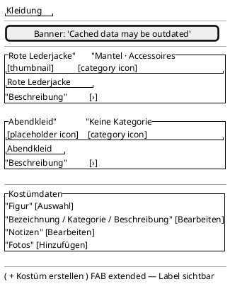

<!-- SPDX-License-Identifier: AGPL-3.0 -->
<!-- Copyright (C) 2024-2026 Breakdown RS Contributors -->
<!-- Co-authored-by: space-bunny-free (opencode-go) -->

# Costumes (Ist) — Screen Spec

## Purpose & Context

The costume overview is the season's working contact sheet for the costume department. It replaces UUID-like list labels with the first detail subject, category, and description, and keeps editing in the same screen. It is used during preparation, assignment, and photo continuity work.

## Navigation

Reached from the **Kleidung** navigation destination after selecting a season and active block. A tile selection reveals the costume editor below the grid on this screen. The compatibility detail route is no longer the normal navigation path. Back behavior remains the shell/tab navigation behavior. AUTHZ-GATE: the editor's assignment, detail, notes, and photo commands resolve the current membership before any network call; photo bytes are not fetched when the photo capability is unavailable.

## Layout

Compact layouts use two columns; medium and expanded layouts use three columns. A tile is a photo-backed card when a ready thumbnail exists and a token-colored placeholder card otherwise. The selected costume editor follows the grid and contains identity editing before secondary notes, assignment, and photos.

## Components & Semantics

| Element | M3 component | Semantics | Copy key |
|---|---|---|---|
| Screen title | Top app bar | Costume overview identity | `nav.costumes` |
| Costume tile | Card | Opens the inline editor; announces designation and category | `costumes.tile` |
| Tile designation | Text overlay | First detail subject, notes fallback, then generic designation; never a UUID | `costumes.tile.name` |
| Category icon | Icon | Visual category cue; category text remains visible | `categories.icon` |
| Placeholder | Card surface | No ready photo; announces the same designation and category | `costumes.placeholder` |
| Editor heading | Section heading | Identity editing context | `costumeDetail.title` |
| Notes section | Secondary section | Secondary notes, never the primary identity | `costumeDetail.notes` |
| Create action | Extended FAB | Creates a costume shell and reveals its editor | `costumes.create` |

## States

Loading: the grid shows a progress indicator. Data: adaptive tile grid with identity overlays. Empty: the existing honest empty state and create CTA. Error: Problem-Details `code` routes to localized copy and retry. Stale: cache banner remains above the grid. Optimistic: a shell or saved detail appears with a sync/status indicator until bounded reconciliation replaces it. Photo placeholder: photo-less, pending, failed, or client-gated tiles use the category placeholder surface.

## Interactions

Tapping a tile reveals the editor below the grid. The existing detail command saves subject, category, and text; a success confirmation is shown before the dialog closes. Notes remain available in the secondary section. Assignment and photo capture/delete continue to use the existing capability gates and reconciliation. Pull-to-refresh reconciles the season projection. The create action creates a shell and selects its editor without opening a separate detail route.

## Input & Validation

Detail editing requires non-empty text; optional subject becomes the first detail designation and optional category is selected from the season category projection. Notes accept free text. Server Problem-Details codes, not localized backend detail text, drive error copy. The add-detail command sends the generated wire UUID and uses the optimistic-after-2xx projection overlay.

## Accessibility & i18n

Every tile exposes designation and category through semantics and visible text. Category icons reinforce the visible category label and have a deterministic unknown-category fallback. All copy uses the German/English ARB catalogs; the UUID is never a title. Dark/light surfaces use theme color roles and the grid remains two columns on compact widths.

## Tests

Widget tests: tile subject/category/text, deterministic category icon, placeholder surface, no-UUID fallback, inline editor selection, and detail-save confirmation. Golden tests: `costumes_screen_light_android`, `costumes_screen_dark_android`, `costumes_screen_light_macos`, and `costumes_screen_dark_macos` with photo-less placeholder tiles. Existing costume assignment and detail-command tests remain in the widget tier. The costume assignment/photo flows remain designated Gherkin flows.
