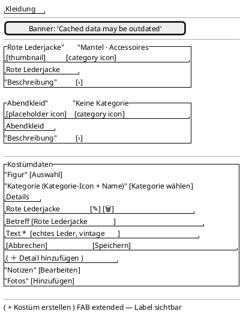

<!-- SPDX-License-Identifier: AGPL-3.0 -->
<!-- Copyright (C) 2024-2026 Breakdown RS Contributors -->
<!-- Co-authored-by: space-bunny-free (opencode-go) -->

# Costumes (Ist) — Screen Spec

## Purpose & Context

The costume overview is the season's working contact sheet for the costume department. It replaces UUID-like list labels with the first detail subject, category, and description, and keeps editing in the same screen. It is used during preparation, assignment, and photo continuity work.

## Navigation

Reached from the **Kleidung** navigation destination after selecting a season and active block. A tile selection reveals the costume editor below the grid on this screen. The compatibility detail route is no longer the normal navigation path. Back behavior remains the shell/tab navigation behavior. AUTHZ-GATE: the editor's assignment, detail, notes, and photo commands resolve the current membership before any network call; photo bytes are not fetched when the photo capability is unavailable.

## Layout

```plantuml
@startsalt
{
  "Kleidung"
  --
  [Banner: 'Cached data may be outdated']
  --
  {^ "Rote Lederjacke"       "Mantel · Accessoires"
     " [thumbnail]           [category icon]"
     "Rote Lederjacke"
     "Beschreibung"          [›]}
  {^ "Abendkleid"             "Keine Kategorie"
     " [placeholder icon]    [category icon]"
     "Abendkleid"
     "Beschreibung"          [›]}
  --
  {^ "Kostümdaten"
     "Figur" [Auswahl]
     "Kategorie (Kategorie-Icon + Name)" [Kategorie wählen]
     "Details"
     "Rote Lederjacke                [✎] [🗑]"
     "  Betreff [Rote Lederjacke              ]"
     "  Text *  [echtes Leder, vintage       ]"
     "  [Abbrechen]                        [Speichern]"
     "( ＋ Detail hinzufügen )"
     "Notizen" [Bearbeiten]
     "Fotos" [Hinzufügen]}
  --
  ( + Kostüm erstellen ) FAB extended — Label sichtbar
}
@endsalt
```

Compact layouts use two columns; medium and expanded layouts use three columns. A tile is a photo-backed card when a ready thumbnail exists and a token-colored placeholder card otherwise. The selected costume editor follows the grid and contains identity editing before secondary notes, assignment, and photos.

## Components & Semantics

| Element | M3 component | Semantics | Copy key |
|---|---|---|---|
| Screen title | Top app bar | Costume overview identity | `nav.costumes` |
| Costume tile | Card | Opens the inline editor; announces designation and category | `costumes.tile` |
| Tile designation | Text overlay | First detail subject, notes fallback, then generic designation; never a UUID | `costumes.tile.name` |
| Category icon | Icon | Visual category cue; category text remains visible | `categories.icon` |
| Placeholder | Card surface | No ready photo; announces the same designation and category | `costumes.placeholder` |
| Editor heading | Section heading | Identity editing context | `costumeDetail.title` |
| Category row | Icon + text row | The costume's single category (issue #543); icon next to always-visible text; "Ohne Kategorie" when uncategorised | `costumeDetail.category` |
| Category picker | Bottom sheet + rows | Season vocabulary (non-archived), one icon + visible text per option, plus the "Ohne Kategorie" clear row; picking dispatches the costume `set_category` command | `costumeDetail.pickCategory` |
| Detail row | Card + `ListTile` | One row per detail: `subject ?? text` as title, remainder as subtitle; trailing edit + delete icon buttons | `costumeDetail.details` |
| Detail edit action | Icon button (`edit`) | Opens the inline editor below the row, prefilled (`initial: CostumeDetailView`) — the same widget as create mode | `commonEdit` |
| Detail delete action | Icon button (`delete`) | Opens a confirmation dialog first (destructive rule); confirming dispatches `remove_detail` with the costume version echo | `commonDelete` |
| Inline detail editor | Embedded form + `FilledButton` | `＋` create row and every edit action open the SAME `DetailEditor` in place (no modal — keyboard and scroll survive); `text` marked required (`*` label + helper), `subject` marked optional, save disabled while `text` is empty, `AutovalidateMode.onUserInteraction` | `costumeDetail.addDetail` / `commonSave` |
| Notes section | Secondary section | Secondary notes, never the primary identity | `costumeDetail.notes` |
| Create action | Extended FAB | Creates a costume shell and reveals its editor | `costumes.create` |

## States

Loading: the grid shows a progress indicator. Data: adaptive tile grid with identity overlays. Empty: the existing honest empty state and create CTA. Error: Problem-Details `code` routes to localized copy and retry. Stale: cache banner remains above the grid. Optimistic: a shell or saved detail appears with a sync/status indicator until bounded reconciliation replaces it. Photo placeholder: photo-less, pending, failed, or client-gated tiles use the category placeholder surface.

## Interactions

Tapping a tile reveals the editor below the grid. The detail command saves subject and text via the INLINE row editor (issue #545 — the details section shows one row per detail with edit/delete affordances; create and edit use the same shared editor widget that expands in the row, never a modal dialog). A success confirmation and the editor closing follow the acknowledged command (details are pure description — the category lives on the costume, issue #543). Delete asks through a confirmation dialog before dispatching `remove_detail`. The category picker dispatches the costume-level `set_category` command after the assignment membership gate; a foreign-season or archived category is rejected by the API edge with its distinct problem code and narrative ("belongs to a different season" / "archived"), and clearing is the deliberate "Ohne Kategorie" row. Notes remain available in the secondary section. Assignment and photo capture/delete continue to use the existing capability gates and reconciliation. Pull-to-refresh reconciles the season projection. The create action creates a shell and selects its editor without opening a separate detail route.

## Input & Validation

Detail editing requires non-empty text; the required field is marked up front (`*` in the label plus a required-mark helper, honest `costumeDetailTextRequired` narrative), validation runs on first user interaction (`AutovalidateMode.onUserInteraction`), and the save affordance sits disabled until `text.trim()` is non-empty. The optional subject carries the symmetric `(optional)` helper and becomes the first detail designation — no detail category exists any more (issue #543). The edit dispatch sends the FULL detail (existing id), the delete echoes the costume aggregate version. Category picking is costume-level: one category per costume from the season's non-archived vocabulary (the picker joins the projected category read DTO), with the "Ohne Kategorie" row clearing the category. A category from a foreign season is rejected at the API edge with 409 `costume-category.season-mismatch`, rendered as its own localized narrative. Notes accept free text. Server Problem-Details codes, not localized backend detail text, drive error copy. The add-detail command sends the generated wire UUID and uses the optimistic-after-2xx projection overlay; the category command follows the same optimistic + version-fence reconciliation.

## Accessibility & i18n

Every tile exposes designation and category through semantics and visible text. Category icons reinforce the visible category label and have a deterministic unknown-category fallback. All copy uses the German/English ARB catalogs; the UUID is never a title. Dark/light surfaces use theme color roles and the grid remains two columns on compact widths.

## Tests

Widget tests: tile subject/category/text, deterministic category icon, placeholder surface, no-UUID fallback, inline editor selection, detail-save confirmation, the INLINE detail editor (edit opens prefilled, create via the `＋` row, save disabled while required text is empty, delete confirm-first, Err branch → command-error banner), and the category section (current category with icon, picker with icon + text per option, archived rows never offered, clear row, denial narrative with request-counter proof, season-mismatch narrative). Golden tests: `costumes_screen_light_android`, `costumes_screen_dark_android`, `costumes_screen_light_macos`, and `costumes_screen_dark_macos` with photo-less placeholder tiles (the collapsed editor state is unchanged), plus the open-editor state golden `costume_detail_editor_open`. Existing costume assignment and detail-command tests remain in the widget tier. The costume assignment/photo flows remain designated Gherkin flows.
