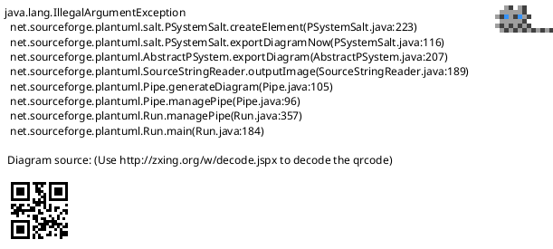
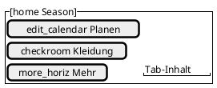
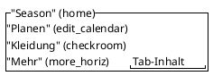

<!-- SPDX-License-Identifier: AGPL-3.0 -->
<!-- Copyright (C) 2024-2026 Breakdown RS Contributors -->
<!-- Co-authored-by: omen-alpha (opencode-go) -->

# Navigation Shell — Screen Spec

> **Status: Soll.** Authored in the `redesign-app-shell-navigation`
> OpenSpec change; describes the adaptive four-tab shell that becomes
> the app's post-login root (team decision 1 of the UI/UX research
> report).

## Purpose & Context
The shell is the persistent frame around all main-app content: it
carries the four top-level destinations (Season, Planen, Kleidung,
Mehr) and keeps every destination's navigation state alive across tab
switches. It hosts no domain content of its own — every tab root is an
existing screen. Used continuously by every user role after login.

## Navigation
Reached directly after the auth gate resolves an authenticated session
(it replaces the previous root screen); it is never pushed or popped
thereafter. The four destinations are tabs, not routes on the back
stack: switching tabs is a user "jump", system back never hops tabs
(within-tab back pops the tab's own stack first; at a tab root the back
intent follows platform app-exit semantics). No route parameters; the
active season is passed to season-scoped tab content as plain data.
AUTHZ-GATE: the shell renders only inside the auth gate (unreachable
without a resolved session); every protected command entry it hosts
keeps its own client-side membership check before any network call.

## Layout

Compact (window < 600dp) — bottom navigation bar:

Medium (600–839dp) — navigation rail beside the content:

Expanded (≥ 840dp) — permanent navigation drawer:

Static structure only: the three morphologies differ only in how the
four labeled destinations are arranged around the tab content. Which
destination is selected, back behavior, and state preservation are
covered in Interactions and Tests — never in the wireframes.

## Components & Semantics
| Element | M3 component | Semantics | Copy key |
|---|---|---|---|
| Season destination | Navigation destination | Home: seasons overview (Season tab content) | `nav.seasons` |
| Planen destination | Navigation destination | Hierarchy Season→Block→Episode→Scene | `nav.planen` |
| Kleidung destination | Navigation destination | Costume domains (Kostüme, Figuren) scoped to the active season | `nav.costumes` |
| Mehr destination | Navigation destination | Import, Kategorien, Über die App, Einstellungen, Abmelden (Berichte bleiben im Day-Board verankert — apply-time decision D8) | `nav.more` |
| Destination labels | Visible text | Mandatory on every destination in every morphology | — |
| Tab content | Content pane | The active destination's screen (its own app bars and FABs stay) | — |

## States
Loading: shell renders as soon as the auth session resolves; tab
content shows its own per-screen loading state. Empty: the Kleidung
tab with no active season shows a season-selection empty state with a
call to action into the Season tab (never an error). Error: per-screen
Problem-Details `code` routing (unchanged). Stale/optimistic: owned by
the hosted screens, not the shell.

## Interactions
Selecting a destination switches the visible tab and preserves each
tab's internal position (per-tab navigation stacks stay alive). System
back: pops within the active tab first; at the tab root it does not
switch tabs (no multi-hop pops); at the root of the initial flow it
requests app exit per platform convention. Sign-out mid-session
returns to the auth gate and resets the selected tab for the next
session. No command is dispatched by the shell itself.

## Input & Validation
N/A — the shell hosts no forms.

## Accessibility & i18n
Every destination renders a visible label in all three morphologies
(glossary rule — icon-only navigation is forbidden); icons reinforce
only. Each destination exposes semantics announcing label and position
(e.g. "Season, Tab 1 of 4"). Touch targets meet 48×48dp; semantic
traversal order is destination row then content. All copy via keys;
German UI copy per glossary.

## Tests
Widget tests: three morphologies via window-size overrides (360 / 700
/ 1000dp), label visibility, semantics ("Tab 1 of 4"), touch-target
size; tab-state preservation and back behavior (no tab hop, exit at
root). Goldens: shell × {compact, medium, expanded} × {light, dark}.
Existing icon-key-based season-tile tests are migrated to the new
tab/entry points. Gherkin: the costume-assignment critical scenario
enters via the Kleidung tab (semantics preserved). Integration:
tab-switch smoke on device.
