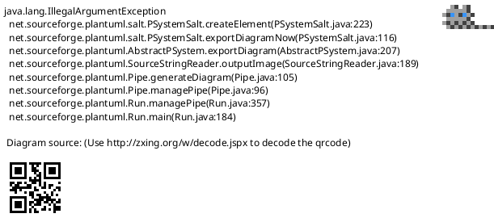
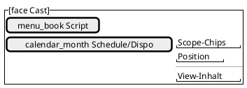
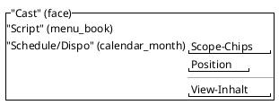

<!-- SPDX-License-Identifier: AGPL-3.0 -->
<!-- Copyright (C) 2024-2026 Breakdown RS Contributors -->
<!-- Co-authored-by: omen-alpha (opencode-go) -->
<!-- Co-authored-by: glm-5.3-flash (opencode-go) -->
<!-- Co-authored-by: space-bunny (opencode-go) -->

# Navigation Shell — Screen Spec

> **Status: Soll.** Authored in the `three-view-navigation-shell` OpenSpec
> change (issue #610). Supersedes the four-destination spec of
> `redesign-app-shell-navigation` (Season | Planen | Kleidung | Mehr): the
> destinations are now three **task-oriented** views.

## Purpose & Context
The shell is the persistent frame around all main-app content: it carries
the three top-level destinations (Cast, Script, Schedule/Dispo), the sticky
season + block scope surface and each view's profile affordance, and keeps
every destination's navigation state alive across switches. It hosts no
domain content of its own — every destination root is an existing screen.
Used continuously by every user role after login.

## Navigation
Reached directly after the auth gate resolves an authenticated session;
never pushed or popped thereafter. The three destinations are destinations,
not routes on the back stack: switching is a user "jump", system back never
hops destinations (within-destination back pops that destination's own
stack first; at a destination root the back intent follows platform
app-exit semantics at the initial Cast root and is consumed elsewhere). No
route parameters; the active season is handed to the season-scoped view
roots as plain data. The former Season and Planen destinations are gone:
season management and the production spine are PUSHED from the season scope
picker's entries, and the former Mehr entries from the per-view profile
action. AUTHZ-GATE: the shell renders only inside the auth gate; every
protected command entry it hosts keeps its own client-side membership check
before any network call.

## Location & Context
Two independent shell-owned surfaces sit above the content (issue #548 +
#610):
- **Location strip** — WHERE YOU NAVIGATED: the `PlanningLocation` chain the
  active destination's topmost route was pushed with. Per-route, per
  destination; hidden at destination roots.
- **Scope chips** — WHAT FILTERS YOUR REQUESTS: the season chip and the
  block chip, sticky across destinations and cold starts. The season chip
  carries the active season as plain data from the shell state; the block
  chip keeps its label-less-scope backfill and foreign-season narrative.
The whole bar is hidden when neither surface has anything to say.

## Layout

Compact (window < 600dp) — bottom navigation bar:

```plantuml
@startsalt
{
  T
  --
  { "Scope: Season {n}" | "Filter: Block {n}" | "Position" }
  --
  { "View-Inhalt" }
  --
  [face Cast] [menu_book Script] [calendar_month Schedule/Dispo]
}
@endsalt
```

Medium (600–839dp) — navigation rail beside the content:

```plantuml
@startsalt
{
  {^ [face Cast]
     [menu_book Script]
     [calendar_month Schedule/Dispo] | { "Scope-Chips"
        "Position"
        ---
        "View-Inhalt" } }
}
@endsalt
```

Expanded (≥ 840dp) — permanent navigation drawer:

```plantuml
@startsalt
{
  {^ "Cast" (face)
     "Script" (menu_book)
     "Schedule/Dispo" (calendar_month) | { "Scope-Chips"
        "Position"
        ---
        "View-Inhalt" } }
}
@endsalt
```

Static structure only: the three morphologies differ only in how the three
labeled destinations and the scope surface are arranged around the view
content. Which destination is selected, back behavior and state preservation
are covered in Interactions and Tests — never in the wireframes.

## Components & Semantics
| Element | M3 component | Semantics | Copy key |
|---|---|---|---|
| Cast destination | Navigation destination | Roster + costumes + costume categories for the active season | `nav.cast` |
| Script destination | Navigation destination | The season's chronological scene overview | `nav.script` |
| Schedule/Dispo destination | Navigation destination | The season's shooting days in calendar order | `nav.schedule` |
| Destination labels | Visible text | Mandatory on every destination in every morphology | — |
| Season scope chip | Assist chip | The active season; tap opens the season scope picker | `scopeChipSeason` |
| Block scope chip | Assist chip | The sticky block filter; tap opens the block picker | `scopeChipBlock` |
| Season scope picker | Screen | Season rows (pick), *Seasons verwalten*, *Produktion verwalten* | `scopeChipSeasonPickTitle` / `seasonScopeManageSeasons` / `seasonScopeManageProduction` |
| Profile action | Icon button with tooltip + labeled sheet entries | Identity, Über die App, Einstellungen, Abmelden (never the costume categories) | `profileTooltip` |
| View content | Content pane | The active destination's screen (its own app bar and FABs stay) | — |

## States
Loading: the shell renders as soon as the auth session resolves; each view
root shows its own loading state. Empty: a view with no active season shows
the shared season-selection empty state whose CTA opens the season scope
picker (never an error); Script/Schedule show their own empty narratives
once a season is set. Error: per-view Problem-Details `code` routing.
Partial: the Script and Schedule views render a partial-load notice when
their client-side fan-out failed for at least one episode. Stale/optimistic:
owned by the hosted screens.

## Interactions
Selecting a destination switches the visible content and preserves each
destination's internal position (per-destination navigators stay alive).
System back: pops within the active destination first; at a destination root
it does not switch destinations (no multi-hop pops); at the root of the
initial (Cast) destination it requests app exit per platform convention.
Picking a season in the scope picker sets the active season (persisted per
session) and pops, so all three views rescope at once. Sign-out from the
profile menu resets the selected destination and drops the active season for
the next session. The shell dispatches no domain command itself.

## Input & Validation
N/A — the shell hosts no forms.

## Accessibility & i18n
Every destination renders a visible label in all three morphologies
(glossary rule — icon-only navigation is forbidden); icons reinforce only.
Each destination exposes semantics announcing label and position (e.g.
"Cast, Tab 1 von 3" — the total is a placeholder, not a baked-in literal).
Touch targets meet 48×48dp; semantic traversal order is destination row then
scope surface then content. All copy via keys; German UI copy per glossary.

## Tests
Widget tests: three morphologies via window-size overrides (360 / 700 /
1000dp), label visibility, semantics ("Cast, Tab 1 von 3"), touch-target
size; destination-state preservation and the back contract (no hop, exit at
the Cast root). Goldens: shell × {compact, medium, expanded} × {light,
dark}. Gherkin: the costume-assignment critical scenario enters through the
Cast view (the season is set from the scope picker). Integration:
destination-switch smoke on device.
