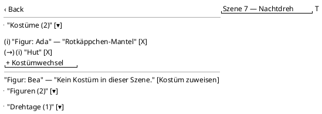

<!-- SPDX-License-Identifier: AGPL-3.0 -->
<!-- Copyright (C) 2024-2026 Breakdown RS Contributors -->
<!-- Co-authored-by: glm-5.3-flash (neuralwatt) -->

# SceneDetail — Screen Spec

## Purpose & Context
The scene detail screen is the working surface for one scene's costume
preparation: its summary, its assigned characters, the costume each
character wears IN THIS SCENE (ordered costume beats, issue #546), and
the shooting days it is scheduled on. Used by the costume department
while prepping and on set; short dwell time, one-handed phone use.

## Navigation
Reached from the Planen tab → Block → Episode → scene list (drill-down
push). Back returns to the episode's scene list. Route parameters:
`seasonId`, `episodeId`, `sceneId` — all read-DTO ids the user acted on
(never a second projection lookup to fill in command context — CQRS
boundary). AUTHZ-GATE: costume-beat commands (`POST/PATCH/DELETE
/v1/scenes/{id}/costumes…`) run the client-side `assign_costumes`
capability check BEFORE any network call (denial shows the localized
403 narrative and never issues the request).

## Location & Context
The screen is pushed with a typed `SceneLocation` argument (issue #548):
the shell's location strip renders Season → Block → Episode → Scene
from the pushed chain. The scope chip (sticky active-block filter) is
shell-owned; this screen does not duplicate it. Direct-pumped
tests/goldens push without the argument — the strip stays hidden.

## Layout

Static structure only (rule box): each section is an `ExpansionTile` on
a scrollable list; beat rows render one `ListTile` per (character,
beat), beats after the first carry a `→` prefix; characters without a
beat render the inline empty state with an assign affordance.

## Components & Semantics
| Element | M3 component | Semantics | Copy key |
|---|---|---|---|
| Costumes section header | ExpansionTile title | Beat count | `sceneDetailCostumesTitle` |
| Beat row | ListTile | One (character, beat): costume identity + wardrobe cue | `costumeTileLabelFallback` fallback |
| Change arrow | `→` prefix text | Change from the previous beat of the character | — (punctuation, not copy) |
| Category icon | Leading icon | Category of the beat's costume | — |
| Remove beat | IconButton (confirm-first) | Removes the beat from the scene | `sceneDetailRemoveCostumeTooltip` |
| Empty beat state | ListTile + button | Character assigned, no costume in this scene | `sceneDetailNoCostumeInScene`, `sceneDetailAssignCostume` |
| Append change | FilledButton.tonal | Adds another beat for the character | `sceneDetailAddChange` |
| Costume picker | Bottom sheet (Android) / centered dialog (macOS) | Selection, not an editor | `sceneDetailPickCostumeTitle`, `sceneDetailCostumeCueHint` |
| Command error | SnackBar | Localized per problem `code` | `sceneBeatError*` keys |

## States
Loading: first snapshot in flight → centered spinner. Data: sections
above. Empty: scene without characters renders the section's explicit
empty line (`sceneDetailNoCharacters`). Stale: retained rows with the
cache-freshness flag. Optimistic: after a 2xx beat ack the section
renders the optimistic beat list immediately (version-fenced overlay);
while reconciling a spinner row shows, on bounded-retry exhaustion a
cloud-off row with warning copy (`reconcileStaleWarning`) — never a
silent discard. Error: read errors per `code`
(`sceneDetailFetchError`); command errors per `code`
(`sceneBeatErrorNotInScene`, `sceneBeatErrorNotFound`,
`sceneBeatErrorValidation`, `concurrency.version-mismatch`,
sign-in/network/generic fallbacks).

## Interactions
* Pick costume (empty state or `+ Kostümwechsel`): opens the picker
  sheet → `POST /v1/scenes/{id}/costumes` with the acted-on scene's
  version echo (version fence: freshest known version wins). 2xx →
  optimistic beat append + bounded-retry reconciliation.
* Remove beat: confirm-first dialog → single remaining beat dispatches
  `DELETE /v1/scenes/{id}/costumes/{character_id}` (clear-all = „kein
  Kostüm in dieser Szene"), otherwise
  `DELETE …/costumes/{character_id}/{order}`.
* Failed command: no local edit was made before the ack — the projected
  state stays, the projection refreshes (version reconcile), the error
  surfaces keyed on `code`; never an automatic re-dispatch.
* Pull-to-refresh: reconciliation pass (single-flight, bounded retries).

## Input & Validation
The picker's note field is free text (optional wardrobe cue), trimmed;
empty becomes `null` on the wire. No other inputs. Problem-code → copy
mapping: `scene.character-not-in-scene` → `sceneBeatErrorNotInScene`,
`scene.beat-not-found` → `sceneBeatErrorNotFound`, `scene.validation`
→ `sceneBeatErrorValidation`, `concurrency.version-mismatch` → shared
conflict copy, auth/membership denials → sign-in copy,
`transport.*` → network copy, else generic with the code.

## Accessibility & i18n
All section headers, buttons, and remove affordances carry visible
labels (glossary rule); icons reinforce only. Beat rows announce
character, costume identity, and cue via the ListTile semantics node;
the change arrow is decorative. All copy via ARB keys (de template +
en parity gate); backend `detail` text is never rendered.

## Tests
Widget tests (Tier 2): one beat row; two rows with `→`; `+
Kostümwechsel`; empty-state affordance; picker dispatch; AUTHZ-GATE
denial (capability check blocks before the network call — fake repo
call count of zero); optimistic 2xx render + 409 refetch. Unit (Tier
1): beat grouping order, tile-identity label resolution. Golden (Tier
2): first scene-detail goldens (German template locale). No Gherkin:
the scene-costume flow is not one of the three designated critical
scopes.
