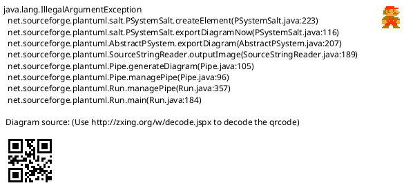

<!-- SPDX-License-Identifier: AGPL-3.0 -->
<!-- Copyright (C) 2024-2026 Breakdown RS Contributors -->
<!-- Co-authored-by: space-bunny (opencode-go) -->

# Schedule/Dispo View — Screen Spec

> **Status: Soll.** Authored in the `three-view-navigation-shell` OpenSpec
> change (issue #610): the season's shooting days as one calendar-ordered
> board, instead of a per-episode day list buried in the hierarchy spine.

## Purpose & Context
The Schedule/Dispo view answers „what shoots when?" — the active season's
shooting days in calendar order with the episode each day belongs to. Used
by the production coordinator for planning and by everyone else to answer
„ist Szene 14 heute dran?".

## Navigation
Reached as navigation destination 3 of 3. Tapping a row opens that
episode's shooting-day board (`ShootingDaysScreen`) with the episode DTO and
the season id as navigation context — the same entry the hierarchy spine
uses, so that board's action set (rename, reschedule, unschedule, archive,
reports) is unchanged. With no active season: the shared season-selection
empty state. AUTHZ-GATE: this view dispatches no command; the pushed day
board keeps its own membership checks.

## Location & Context
The shell renders the location strip and the season + block scope chips
above this view. As a destination ROOT the strip stays hidden; opening the
episode day board deepens the chain to Season → Block → Episode. A sticky
block scope for this season narrows the board to that block; a scope from
another season is ignored (same reuse rule as the scope chip).

## Layout

Static structure only: an optional partial-load notice row above the day
rows; ordering and degradation rules live in Interactions and States.

## Components & Semantics
| Element | M3 component | Semantics | Copy key |
|---|---|---|---|
| View title | Top app bar | The destination's own title | `navSchedule` |
| Profile action | Icon button with tooltip | Identity, Über die App, Einstellungen, Abmelden | `profileTooltip` |
| Day row | List item with event icon | The day's own label (server) or its date as the title, the episode as the subtitle | `scheduleDayLabel` / `scheduleDayUndated` / `scriptEpisodeLabel` |
| Partial-load notice | List item | Names how many episodes could not be read | `schedulePartialLoad` |
| Empty state | Centered narrative | „Für diese Season sind noch keine Drehtage geplant." | `scheduleNoDays` |
| Error state | Centered narrative + retry | Keyed on the stable problem code | `scheduleFetchError` |

## States
Loading: a progress indicator while the composition runs. Empty: no planned
days → plain empty state. Partial: at least one episode failed → the loaded
days plus a notice. Error: an unreadable block list → the code-keyed error
state with retry. Stale: the per-episode fetch seams own their TTL cache; a
pull-to-refresh re-runs the composition.

## Interactions
The board is a READ composition mirroring the Script view: blocks of the
season → their episodes → their shooting days, ordered by the projected
calendar date (undated days keep a stable place after the dated ones).
Pull-to-refresh re-runs the composition. Tapping a row opens the episode's
day board. Selecting another season recomposes the view. Reports stay
anchored in the day board (design D8) — this view adds no report entry.

## Input & Validation
N/A — this view hosts no forms; day creation/editing stays on the day board.

## Accessibility & i18n
Every row carries a visible day label (or the explicit "without a date"
narrative) and its episode as text; the partial-load notice pairs a warning
icon with a visible narrative. All copy via keys.

## Tests
Unit (Tier 1): date ordering, undated-last, and the provider's Ok/Err/partial
branches. Widget (Tier 2): calendar-ordered rows, empty state, partial
notice. Goldens: the view root in {light, dark}. Integration: the
destination-switch smoke on device visits this destination.
