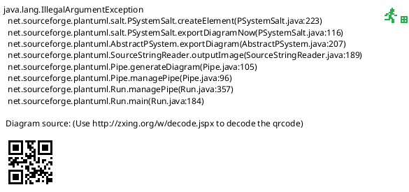

<!-- SPDX-License-Identifier: AGPL-3.0 -->
<!-- Copyright (C) 2024-2026 Breakdown RS Contributors -->
<!-- Co-authored-by: space-bunny (opencode-go) -->

# Script View — Screen Spec

> **Status: Soll.** Authored in the `three-view-navigation-shell` OpenSpec
> change (issue #610): the season's scenes as ONE continuously numbered
> chronological overview, replacing the per-episode scene lists that were
> only reachable through the hierarchy spine.

## Purpose & Context
The Script view answers „what does the text say, in order?" — every scene
of the active season in one numbered list, so the user can read ahead,
jump to a scene and assign characters/costumes/shooting days without
drilling block → episode → scene first.

## Navigation
Reached as navigation destination 2 of 3. Tapping a row pushes the scene
detail screen with that scene read DTO (plus its block/episode DTOs) as
navigation context — no additional projection lookup fills ids in. Back
returns to the list. With no active season: the shared season-selection
empty state. AUTHZ-GATE: the view dispatches no command; the pushed detail
screen keeps its own membership checks for the scene's character/costume
writes.

## Location & Context
The shell renders the location strip and the season + block scope chips
above this view. As a destination ROOT the strip stays hidden; pushing the
scene detail deepens the chain to Season → Block → Episode → Scene, which
the strip then renders. A sticky block scope for this season narrows the
overview to that block; a scope from another season is ignored (the same
reuse rule the scope chip renders as „gilt hier nicht").

## Layout

Static structure only: an optional partial-load notice row above the scene
rows; ordering, numbering and degradation rules live in Interactions and
States.

## Components & Semantics
| Element | M3 component | Semantics | Copy key |
|---|---|---|---|
| View title | Top app bar | The destination's own title | `navScript` |
| Profile action | Icon button with tooltip | Identity, Über die App, Einstellungen, Abmelden | `profileTooltip` |
| Scene row | List item with leading number avatar | Projected scene number as the visible label, scene summary as the title, its episode as the subtitle | `scriptSceneNumber` / `scriptSceneNumberUnknown` / `scriptEpisodeLabel` |
| Partial-load notice | List item | Names how many episodes could not be read | `scriptPartialLoad` |
| Empty state | Centered narrative | „Noch keine Szenen in dieser Season." | `scriptNoScenes` |
| Error state | Centered narrative + retry | Keyed on the stable problem code | `scriptFetchError` |

## States
Loading: a progress indicator while the composition runs. Empty: no scenes
in the season → plain empty state (no CTA — scenes are created in the scene
detail/sheet). Partial: at least one episode failed → the loaded scenes plus
a notice; a shortened list is never presented as the complete script. Error:
an unreadable block list → the code-keyed error state with retry. Stale: the
composed rows come from the per-episode fetch seams, each of which owns its
TTL cache; a pull-to-refresh re-runs the composition.

## Interactions
The list is a READ composition: blocks of the season → their episodes →
their scenes, ordered by the projected scene number (unnumbered scenes sort
last and say so). Pull-to-refresh re-runs the composition. Tapping a row
pushes the scene detail. Selecting another season (scope picker) recomposes
the view for that season. No command is dispatched from this view.

## Input & Validation
N/A — this view hosts no forms.

## Accessibility & i18n
Every row carries a visible number/label and its episode as text; the
partial-load notice pairs a warning icon with a visible narrative. All copy
via keys; goldens use the German template locale.

## Tests
Unit (Tier 1): merge order, unnumbered-last, deterministic tie-break, and
the provider's Ok/Err/partial branches. Widget (Tier 2): season-empty state,
numbered rows, empty state, partial notice, error state. Goldens: the view
root in {light, dark}.
