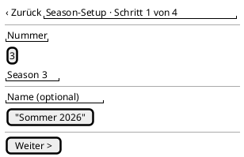
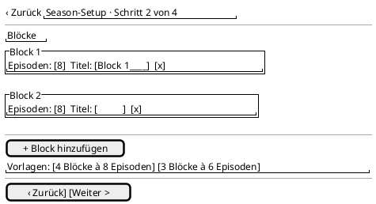
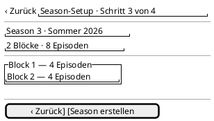
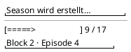
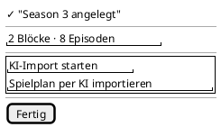
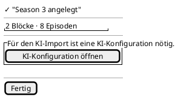

<!-- SPDX-License-Identifier: AGPL-3.0 -->
<!-- Copyright (C) 2024-2026 Breakdown RS Contributors -->
<!-- Co-authored-by: omen-alpha (opencode-go) -->
<!-- Co-authored-by: space-bunny-free (opencode-go) -->

# SeasonSetupWizard — Screen Spec

> Authored in the `add-season-setup-wizard` OpenSpec change. A linear
> four-step wizard (Season → Blocks → Review → Completion) that creates the
> production hierarchy in one guided flow, with smart defaults and the
> conditional AI-import call to action on the completion step.

## Purpose & Context

Sets up a new production in one pass: a season with a smart-default
number, repeatable block drafts (episode counts, optional titles),
a review summary, and sequential dispatch of the existing create
commands. Used at the start of a production — by users who would
otherwise create seasons, blocks, and episodes one row at a time on
the hierarchy screens. Aborts are destructive (team decision 3); the
completion screen offers AI import only when a configuration exists
(team decision 6).

## Navigation

Reached from the Season tab's guided empty state ("Season-Setup
starten") and from its extended FAB — both open this route, and since
issue #511 the FAB is the **primary** create entry in every state (the
manual quick-create sheet is the secondary alternative in the app bar).
The wizard runs as a full-screen pushed route on the Season tab's
nested navigator — the shell tabs stay untouched beneath it. Back
behavior: back-out from the Season/Blocks/Review steps triggers the
discard confirmation; during dispatch, back is blocked until the
sequence settles (completion or partial failure); from the completion
step, back pops to the seasons home. Route parameters: none (the
series id is the dev-define default series, as in the manual
create sheet).

AUTHZ-GATE: each dispatched create command (`POST /v1/seasons`,
`POST /v1/blocks`, `POST /v1/episodes`) runs through its existing
repository gate (authenticated-session check before any network call,
mirroring the backend's `CurrentUser` extractor). The AI-configuration
read on the completion step keeps its own existing gate discipline
(session-only read via the config list route).

## Layout

Step 1 — Season:

Step 2 — Blocks:

Step 3 — Review:

Dispatch overlay (during the sequence):

Step 4 — Completion:

Completion without an AI configuration:

Static structure only: step header, per-step form/summary content,
buttons, and the dispatch progress line. Validation timing, abort
semantics, dispatch sequencing, and the CTA gating live in the
States / Interactions / Input & Validation sections and in tests —
never in the wireframes.

## Components & Semantics

| Element | M3 component | Semantics | Copy key |
|---|---|---|---|
| App bar title | Top app bar | Flow identity | `wizard.title` |
| Step progress | Text + linear indicator | "Schritt x von n" progress | `wizard.progress` |
| Back button | Icon button (visible label where primary) | Previous step / abort confirm | `wizard.back` |
| Number field | Text field (numeric) | Season number, smart default | `wizard.season.numberLabel` |
| Name field | Text field (optional) | Season name | `wizard.season.nameLabel` |
| Live preview | Supporting text | "Season {n}" preview | `wizard.season.preview` |
| Block draft card | Card | One block draft (episode count, optional title, removal) | `wizard.blocks.draft` |
| Derived block number | Draft-card headline (read-only) | The series-scoped number the draft dispatches under — derived from the series' existing blocks at wizard open (`max + 1`), never editable | `wizard.blocks.draft` |
| Episode-count field | Text field (numeric) | Episodes per block draft | `wizard.blocks.episodeCountLabel` |
| Draft-title field | Text field (optional) | Block title | `wizard.blocks.titleLabel` |
| Remove-draft button | Icon button + visible removal affordance in the card | Removes one draft | `wizard.blocks.remove` |
| Add-draft button | Outlined button | Appends an empty draft | `wizard.blocks.addDraft` |
| Template chips | Assist chips | Expand a preset into drafts | `wizard.blocks.template4x8` / `wizard.blocks.template3x6` |
| Next button | Filled button | Advance when the step validates | `wizard.next` |
| Review summary | Card | Season + blocks + total episodes | `wizard.review.title` |
| Confirm button | Filled button | Starts the dispatch | `wizard.review.confirm` |
| Dispatch overlay | Linear progress + text | Per-command progress | `wizard.dispatching` |
| Completion title | Headline | Created-season confirmation | `wizard.completion.title` |
| Completion summary | Supporting text | Created structure | `wizard.completion.summary` |
| AI-import CTA | Filled button | Jumps to the AI-import flow (only with config) | `wizard.completion.importCta` |
| AI prerequisite info card | Card + outlined button | Prerequisite hint → AI config screen (no config) | `wizard.completion.aiInfo` / `wizard.completion.aiInfoCta` |
| Partial-failure title | Headline + banner | Created-so-far summary | `wizard.completion.partialTitle` |
| Retry button | Filled button | Retries the remaining commands in-session | `wizard.completion.retry` |
| Done button | Filled button | Closes the wizard | `wizard.completion.done` |
| Abort dialog | Dialog | Discard confirmation | `wizard.abort.title` / `wizard.abort.body` / `wizard.abort.discard` / `wizard.abort.keepEditing` |

## States

Loading: N/A — the wizard has no projection reads of its own; its
season-number default derives from the already-loaded seasons
projection (the smart default falls back to 1 when the projection is
empty). Data: the drafts and created refs held in the wizard state
(never a Drift write pre-submit). Empty: the Blocks step always holds
at least one draft by default, so the "no drafts" state exists only
transiently after removals. Error: command failures surface keyed on
the stable problem `code` (localized copy, never backend `detail`);
partial failure shows the created-so-far summary with retry. Stale /
Optimistic: the dispatched commands insert their established
optimistic overlays in the underlying screens; the wizard's own
progress is the per-command sub-step display.

## Interactions

Step navigation: Next advances only when the current step validates;
back returns without discarding. The TWO back affordances are distinct
controls with distinct behavior: the IN-WIZARD back (app-bar arrow and
the "Zurück" navigation row button, keys `wizard-back` / `wizard-prev`)
performs STEP NAVIGATION ONLY — it moves to the prior step and never
discards anything; the ROUTE-EXIT action (system back gesture /
predictive-back on the wizard route itself) opens the discard
confirmation while editing. Drafts are therefore never lost by ordinary
step navigation. On the Review step, confirm starts
the sequential dispatch: season create, then per block the block
create followed by its episode creates — ids flow exclusively from
command responses into subsequent commands (CQRS boundary; no second
projection lookup). Each command's 2xx triggers the established
optimistic + bounded-retry reconciliation of the underlying
repository; the wizard displays per-command progress and awaits the
ack before the next command. A command failure stops the sequence:
created-so-far summary + in-session retry of the remaining commands
(no background queue, no offline persistence). Abort: cancel or the
route-exit back during editing/review opens the discard confirmation
(the in-wizard back button does NOT — it only navigates steps, see
above); confirming discards everything and pops the wizard (nothing is
persisted — decision 3). During dispatch the cancel affordance is
disabled and route exit is blocked (no discard dialog can open over a
running dispatch). On
completion, Done pops to the seasons home; the AI-import CTA renders
only when an AI configuration exists (checked before render via the
existing config read), otherwise the info card links to the
configuration screen.

## Input & Validation

Season step: number is a positive integer — invalid input disables
Next with inline copy `wizard.errors.positiveNumber` (the same key for
both positive-integer validations, per the glossary); name is optional.
Blocks step: every draft's episode count is a positive integer —
invalid copy `wizard.errors.positiveNumber`; zero drafts at submit time
disable Next with copy `wizard.errors.noBlocks`; templates expand
into editable drafts. Block numbers are NOT fields: the backend enforces
block-number uniqueness per SERIES
(`idx_projection_block_series_number`), so each draft's number is derived
from the series' existing blocks at wizard open (`max + 1`, read-only
headline). Number conflicts (409 `seasons.conflict`) and
other command failures surface keyed on their `code` (problem-code →
copy mapping lives with the screen's error copy, never backend
`detail` text).

## Accessibility & i18n

The step progress announces "Schritt x von n" via semantics; the
dispatch overlay exposes its per-command sub-step to screen readers.
Buttons carry visible labels; icons (add/remove) reinforce only.
Block drafts announce their number, episode count, and title. All
copy via glossary keys (`wizard.*`); German UI copy. The number fields
use numeric input with `TextInputFormatter` limits; errors are inline
text, never platform dialogs.

## Tests

Widget tests: per-step semantic finders (`wizard-number-field`,
`wizard-name-field`, `wizard-next`, `wizard-block-draft-{i}`,
`wizard-add-draft`, `wizard-apply-template-4x8`,
`wizard-review-summary`, `wizard-confirm`, `wizard-progress`,
`wizard-completion-import-cta`, `wizard-completion-ai-info`,
`wizard-retry`), smart default, validation copy per error code,
template application, draft removal, PopScope abort paths (confirm
discard / disabled during dispatch), conditional completion CTA both
ways. Goldens: all four steps + dispatch overlay + completion (light
and dark), validation and partial-failure states. Gherkin:
`features-spec/setup/season-wizard.feature` — designated critical
flow (setup): happy path, template application, partial failure +
retry, abort with discard (runs on device via `flutter_gherkin`).
Integration tier: full wizard run against the dev backend.
