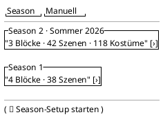
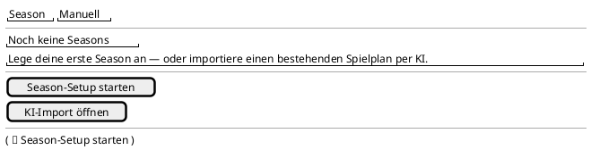

<!-- SPDX-License-Identifier: AGPL-3.0 -->
<!-- Copyright (C) 2024-2026 Breakdown RS Contributors -->
<!-- Co-authored-by: omen-alpha (opencode-go) -->
<!-- Co-authored-by: space-bunny-free (opencode-go) -->

# Seasons Home (Soll) — Screen Spec

> **Status: Soll.** Authored in the `redesign-seasons-home` OpenSpec
> change; describes the card-based seasons overview that becomes the
> Season tab's home content (supersedes the Ist probe in
> `docs/design/screens/seasons.md` once this change lands).

## Purpose & Context

The app's home surface: a card overview of the active series' seasons
with cached planning metadata (blocks/scenes/costumes counts), serving
as the primary jump-off into planning and costuming. Used daily by every
user role; metadata staleness is made visible instead of hidden.

## Navigation

Reached as Season tab content inside the adaptive navigation shell
(destination 1 of 4) — never pushed. From here: a season card tap sets
the active season (from the acted-on row DTO) and jumps to the Planen
tab, where the Season→Blocks push happens on the Planen tab's nested
navigator (the shell's hierarchy spine); the empty state's setup CTA
and the extended FAB both open the **season setup wizard**; the app
bar's "Manuell" action opens the manual quick-create sheet; the import
CTA jumps to the Mehr tab's AI-import entry.
Back behavior: system back at this tab root follows the shell's
app-exit contract. Route parameters: none.

AUTHZ-GATE: season creation is auth-only — the setup CTA, the FAB and
the manual action render only for a resolved authenticated session (the
client-side gate mirrors the backend's `CurrentUser` extractor; no
network call is issued signed out). The AI-import path keeps its
client-side membership check inside the import submit controller before
any network call.

## Layout

Compact — Season tab content with card list and extended FAB:

Empty state:

Loading skeleton (cold start, no cached rows):

```plantuml
@startsalt
{
  { "Season"                          | "Manuell" }
  --
  {^ {… }}
  {^ {… }}
  {^ {… }}
  --
  ( 🚀 Season-Setup starten )
}
@endsalt
```

Static structure only: the tab title, the card list (title + metadata line
+ chevron), the secondary "Manuell" app-bar action, the guided extended
FAB, the two-CTA empty state, and the skeleton placeholders. Which state
renders when, the entry-point ranking, stale semantics, and all
create/reconcile behavior live in the States / Interactions sections
and tests — never in the wireframes.

## Components & Semantics

| Element | M3 component | Semantics | Copy key |
|---|---|---|---|
| Tab title | Top app bar | Screen identity | `nav.seasons` |
| Manual action | App bar text button | Secondary/advanced create (quick-create sheet) | `seasons.create.manual` |
| Season card | Card (outlined on light, filled on dark) | Opens the season's planning view | `nav.seasons` |
| Card title | Card headline | Season name or fallback "Season {number}" | `seasons.tile` |
| Card metadata | Card supporting text | Cached block/scene/costume counts, omitted when absent | `seasons.meta.blocks` / `seasons.meta.scenes` / `seasons.meta.costumes` |
| Stale indicator | Icon + relative time | Cached metadata older than TTL | `seasons.stale` |
| Chevron affordance | List-item affordance | Drill-down (paired with visible title) | n/a |
| Setup FAB | Extended FAB | Primary create: opens the guided setup wizard (dispatches `POST /v1/seasons` + blocks/episodes) | `seasons.create.fab` |
| Empty headline | Text | No seasons yet | `seasons.empty.title` |
| Empty guidance | Card supporting text | One sentence of guidance | `seasons.empty.guidance` |
| Setup CTA | Filled button | Starts the guided setup wizard | `seasons.empty.setupCta` |
| Import CTA | Outlined button | Jumps to the Mehr tab's AI-import entry | `seasons.empty.importCta` |
| Stale banner | Banner | List-level cache staleness (existing) | `errors.connectionLost` |
| Overlay card | Card | Optimistic create entry with sync indicator | `seasons.syncing` |

## States

Loading (cold start, no cached rows): skeleton placeholder in the list
area — the empty state does NOT flash for the transient loading window.
Data: one card per projected season with metadata where cached. Empty:
headline + guidance + setup/import CTAs. Error: Problem-Details `code`
routed to localized copy (never backend `detail` text); the list
serves retained cached rows with the stale banner. Stale: two levels —
(a) the list-level stale banner (existing `isStale` flag) and (b) the
per-card stale indicator when the card's cached metadata is older than
TTL. Optimistic: a newly created season renders as a card ("Just
created — syncing…") with the sync spinner, or the stale warning +
cloud-off icon after bounded-retry exhaustion (existing keys
`overlay-<id>`, `overlay-spinner`, `overlay-warning` preserved).

## Interactions

Card tap: sets the active season from the acted-on DTO (CQRS boundary:
no second projection lookup) and switches to the Planen tab — the
Season→Blocks push stays on the Planen tab's navigator (hierarchy
spine; apply-time routing decision, matching the shell's Kategorien
entry). **Entry-point ranking (issue #511):** the guided setup wizard is
the *primary* create path (extended FAB, and the empty state's setup
CTA — both available whether or not seasons exist); the manual
quick-create sheet is the *secondary* alternative behind the app bar's
"Manuell" action. The manual sheet asks only for number and title — the
series is derived from the active project context (never a user-editable
UUID); a build without a default series shows the actionable
build-configuration notice and dispatches nothing. Manual create: on 2xx
the optimistic card is inserted, then reconciled via bounded-retry
refetch; on exhaustion the card is retained with the stale warning.
Import CTA: switches to the Mehr tab (a pure client navigation — no
network call; the membership gate runs inside the import submit
controller before any request). Pull-to-refresh: re-reconciles the
projection. No destructive actions here.

## Input & Validation

N/A — no forms on this screen. The wizard's season-number validation
lives in the wizard (problem codes `seasons.conflict` etc., routed per
`code`); the manual sheet validates its number field and derives the
series id.

## Accessibility & i18n

The extended FAB, the "Manuell" app-bar action and both empty-state
CTAs carry visible labels (glossary rule). Cards announce title +
metadata + staleness via semantics; the chevron is reinforcement, not
the sole carrier of meaning. Card colors come from the M3 theme (no
hardcoded values); contrast is the theme's responsibility. All copy via
glossary keys; German UI copy.

## Tests

Widget tests: card states (projected with/without metadata, optimistic
card, stale indicator), the guided FAB label + its wizard route, the
"Manuell" action opening the manual sheet (no series-id field, derived
series in the command, fail-fast on a build without a default series),
empty-state CTAs (tab switch on import), skeleton on cold start
(no empty-state flash) — semantic finders + key pairings. Goldens:
Season tab (light/dark × cards empty/full/optimistic) + empty state +
skeleton, re-baselined in this change. Gherkin: the season-setup wizard
scenario enters through the guided FAB; the costume-assignment scenario
enters via the shell tabs and is unaffected.
