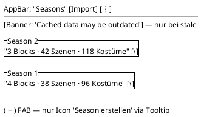

<!-- SPDX-License-Identifier: AGPL-3.0 -->
<!-- Copyright (C) 2024-2026 Breakdown RS Contributors -->
<!-- Co-authored-by: omen-alpha (opencode-go) -->

# Seasons (Ist) — Screen Spec

> **Status: probe.** This is the workflow trial run of the
> `establish-design-doc-workflow` change — it documents the seasons
> screen **as it exists today** (Ist) as a real-world validation of the
> template. It is superseded by
> `docs/design/screens/seasons-home.md` once the `redesign-seasons-home`
> change lands.

## Purpose & Context
The app's home screen: lists the seasons of the active series so the
costume department can enter the hierarchy (blocks/episodes/scenes,
costumes, characters). Used daily by every user role.

## Navigation
Reached after login (auth shell). From here: costume domains via the
Season-tile icons (Kleidung/Figuren/Kategorien), planning via blocks,
AI import via the AppBar icon. Back behavior: system back exits the
list (root screen). AUTHZ-GATE: season creation is gated client-side by
the membership check before the command is dispatched; season reads are
membership-scoped server-side.

## Layout

**Known Ist gaps** (fixed by the redesign changes, documented here as
the probe's findings): the Season-tile icons are icon-only navigation
(violates the glossary's visible-label rule), the FAB carries its
meaning only via tooltip, and the AI-import entry is an AppBar icon
reachable only via tooltip — all three are addressed by
`redesign-app-shell-navigation` / `redesign-seasons-home`.

## Components & Semantics
| Element | M3 component | Semantics | Copy key |
|---|---|---|---|
| App bar | Top app bar | Screen identity | `seasons.title` |
| Season tile | Card (list item) | Opens season detail / drill-down | `seasons.tile` |
| Tile trailing icon | Icon button | Enters costume domain | `nav.costumes` |
| Create FAB | FAB | Creates a season (command `POST /seasons`) | `seasons.create` |
| Stale banner | Banner | Optimistic-stale indicator | `errors.connectionLost` |
| Empty hint | Text | No seasons yet | `seasons.empty` |

## States
Loading: list placeholder. Data: season tiles with counters. Empty:
"Keine Seasons vorhanden" hint (no wizard CTA yet — a redesign gap).
Error: Problem-Details `code` routed to localized copy (never backend
`detail` text). Stale: banner per `cloud_off` (copy key
`errors.connectionLost`). Optimistic: newly created season appears
immediately with a syncing indicator until bounded-retry
reconciliation swaps in the projected entry.

## Interactions
Create season (FAB, gated): dispatches the create command; on 2xx the
tile is inserted optimistically, then reconciled via bounded-retry
refetch; on timeout the optimistic entry is retained with a stale
indicator. Tile tap: drill-down into the season's domains. Overflow
menu: settings, app info, sign out. Pull-to-refresh: re-reconciles the
projection.

## Input & Validation
Create dialog: season name (optional), number (smart default
S_max + 1). Validation errors surface per problem code
(`seasons.nameInvalid` etc.). No other forms on this screen.

## Accessibility & i18n
Visible-label rule violations are the documented Ist gaps (above) and
are closed by the redesign changes; semantics labels announce tile
title + counters. All copy via keys; German UI copy per glossary.

## Tests
Widget tests: tiles render from state (`find.text` semantics);
error/snackbar branches asserted. Golden: `seasons_screen_data`.
Err-branch: create failure surfaces `AsyncError`. Critical-flow
Gherkin is not designated for this screen (widget test tier suffices).
