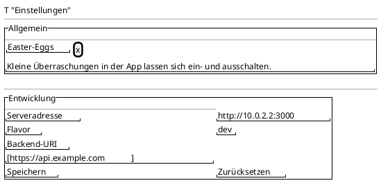

<!-- SPDX-License-Identifier: AGPL-3.0 -->
<!-- Copyright (C) 2024-2026 Breakdown RS Contributors -->
<!-- Co-authored-by: glm-5.3-flash (opencode-go) -->

# Settings — Screen Spec

## Purpose & Context
The app's dedicated full-screen settings: general app settings (every
flavor) and, dev-flavor-only, the development backend switch. It
replaces the former `SettingsDialog` (issue #516). Used occasionally by
every user (Easter-eggs preference) and regularly by developers
(backend override).

## Navigation
Pushed from the Mehr tab's labeled tile „Einstellungen" (`mehr-settings`)
via `Navigator.push` + `MaterialPageRoute`. Back: the AppBar back
button (`Navigator.pop`) and system back — the screen never pops the
session. Route parameters: none. AUTHZ-GATE: the screen itself is
post-authentication (Mehr tab lives inside the auth shell); the save /
reset actions issue requests against the configured backend through the
existing `SessionReset` coordinator, which owns the auth fence — no
additional client-side membership gate applies (server-ownership rule).

## Location & Context
N/A — settings are not a planning-hierarchy surface; the screen is
pushed without a `PlanningLocation` argument, so the location strip
stays hidden (graceful-degradation rule).

## Layout

In the `prod` flavor the „Entwicklung" section is absent; the read-only
rows Serveradresse + Flavor remain, followed by the explanatory prod
note (store compliance).

## Components & Semantics
| Element | M3 component | Semantics | Copy key |
|---|---|---|---|
| App bar title | Top app bar | Screen identity | `settings.title` |
| General section | Section header | Groups always-available settings | `settings.general` |
| Easter-eggs switch | Switch list tile | Global Easter-egg preference (default ON) | `settings.easterEggs` + `settings.easterEggsSubtitle` |
| Development section | Section header | Labels the dev-only area | `settings.dev` |
| Server address row | List item (read-only) | Active effective API base | `settings.serverAddress` |
| Flavor row | List item (read-only) | Active build flavor | `settings.flavor` |
| Backend-URI field | Text field | dev-only editable override with inline validation | `settings.backendUri` |
| Save button | Filled button | Persist → Dio rebuild → invalidate | `settings.save` |
| Reset button | Text button | Remove override, back to default | `settings.reset` |
| Prod note | Text | Explains the absent editor in prod | `settings.prodNote` |

## States
Loading: N/A — the screen reads local state synchronously (the
hydrated easter-eggs notifier and the effective base). Data: rows as
above. Error: the Easter-eggs read failure surfaces as a visible error
state in the general section (fallback default ON); backend-URI save
errors render inline keyed on `code` via the validation copy. Stale:
N/A. Optimistic: the easter-eggs switch flips instantly (local
preference, no projection involved).

## Interactions
- Flipping the Easter-eggs switch persists the value and flips the
  global notifier immediately — AI-Import consumers update live.
- Save (dev): validates inline (`validateApiBase`); on success runs the
  `SessionReset.switchBackend` flow with a linear progress indicator,
  then re-reads the effective base.
- Reset (dev): `SessionReset.resetBackendToDefault`, restores the field
  to the effective base.
- Dismissing the save/reset while a progress run is active: buttons are
  disabled (previous dialog behavior carried over).

## Input & Validation
Backend-URI (dev only): absolute `http`/`https` URI; cleartext `http`
accepted only for emulator/loopback hosts (CWE-319 rule). Validation
errors and save errors surface via the existing `apiBaseValidationCopy`
mapping keyed on `code` — never on `detail` prose.

## Accessibility & i18n
Every destination/action carries a visible label; the switch announces
its state. All copy via glossary keys (`settings.*`); German template +
English catalog. The Easter-eggs switch is a standard M3 switch —
screen-reader friendly by construction.

## Tests
- Widget: tile pushes the screen (no dialog); back navigation;
  general section in both flavors; dev section dev-only; switch flips
  the notifier immediately; save/reset/progress flows.
- Golden: `settings_dev_{light,dark}` + `settings_prod_{light,dark}`
  (replacing the former dialog goldens).
- Unit: easter-eggs store Ok/Err branches, default-ON fallback.
