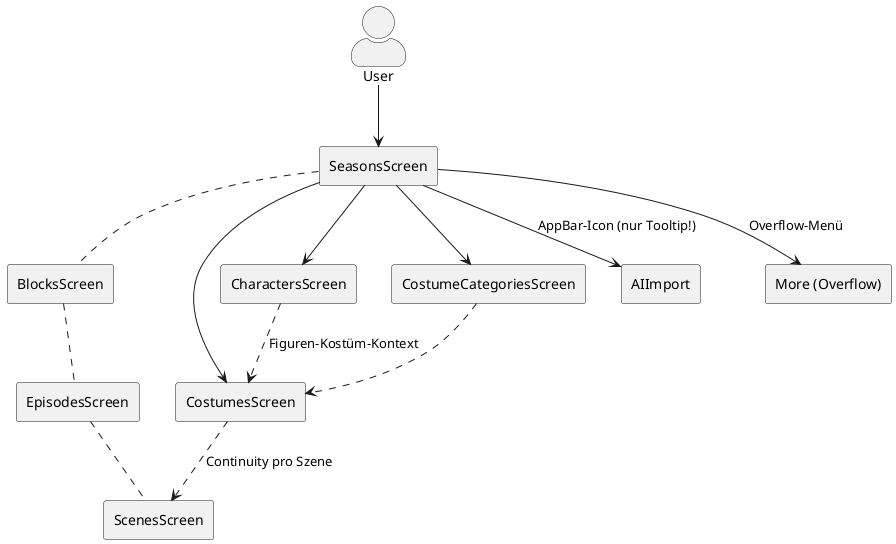
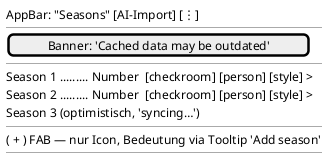
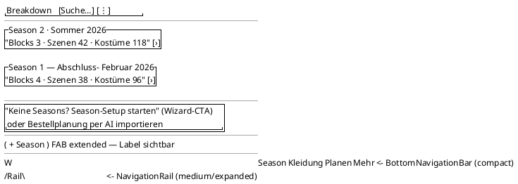
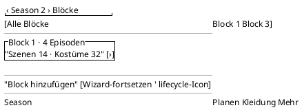
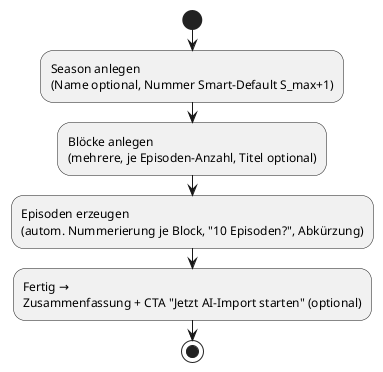
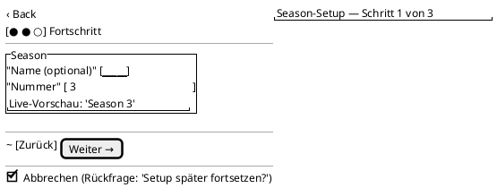
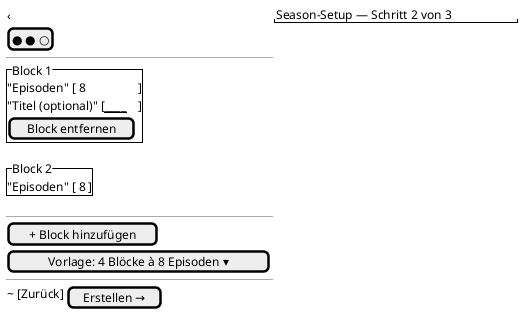

<!-- SPDX-License-Identifier: AGPL-3.0 -->
<!-- Copyright (C) 2024-2026 Breakdown RS Contributors -->
<!-- Co-authored-by: glm-5.3 (neuralwatt) -->

# Textbasierter Design-Workflow & UI/UX-Redesign — Entscheidungsgrundlage

> **Status:** Recherche- und Konzeptbericht (keine Code-Änderung). Grundlage für
> anschließende OpenSpec-Changes (z. B. `establish-design-doc-workflow`,
> `redesign-app-shell-navigation`, `add-season-setup-wizard`).
> **Leser:** Entwicklerteam. **Sprache:** Deutsch, Quellen teils Englisch.

---

## 1. Executive Summary der Empfehlung

**Kernbefund der Analyse:** Das Hauptproblem des Frontends ist **eher
Informationsdesign (Icon-Semantik, Navigations-Flow, Kontext, Guidance) als
visuelles Design.** Es existiert schlicht keine App-Shell: `AuthGate` führt
direkt auf die `SeasonsScreen`, und die gesamte Navigation ist ein tiefer
`Navigator.push()`-Stack — pro Bildschirm ein eigenes `Scaffold`, keine
Bottom-Navigation, keine adaptive Navigation, kein sichtbarer Titel, der sagt,
wo man ist. Die M3-Typografie/Skala alleine zu verbessern würde daran nichts
ändern. Die Empfehlung ist daher: **Struktur und Semantik zuerst (App-Shell,
Navigation, Begriffe), visuelle Politur danach** (Edge_case 3 des Auftrags).

**Methodik-Empfehlung (A):** Ein dreischichtiger, textbasierter
Design-Workflow, der komplett ohne grafische Tools auskommt:

1. **Design-Tokens nach W3C-DTCG-Format** (JSON, `$value`/`$type`) als
   langfristig übertragbare stylistische Wahrheit für Flutter, Svelte, Slint
   und GPUI — per Style Dictionary bzw. Terrazzo in plattformspezifische
   Artefakte übersetzt.
2. **PlantUML Salt für Layout-Wireframes** — bewusst als *Low-Fidelity*-Werkzeug
   für Struktur und Informationsarchitektur, **kombiniert mit** strukturierten
   Markdown-Screen-Specs für Verhalten, Zustände, Semantik und
   Interaktionsdetails, die Salt nicht ausdrücken kann. Salt ersetzt kein
   Figma, und muss es nicht: Es ersetzt *dort*, wo Agenten arbeiten, das
   Kritzeln auf Papier.
3. **Mermaid/PlantUML für Flows** (Navigation, Wizard-Steps) und **eine
   verbindliche Screen-Spec-Vorlage in Markdown** als Vertrag zwischen
   Spec und Implementierung — konsolidiert als OpenSpec-Changes (das Team hat
   schon ein OpenSpec-System und einen `openspec-screen-prompt`-Skill mit
   Prompt-Vorlage: dieser wird erweitert, nicht ersetzt).

**Redesign-Empfehlung (B), priorisiert:**

- **P1 — App-Shell mit M3 `NavigationBar` (compact) / `NavigationRail`
  (medium/expanded):** Tabs *Home (Seasons)*, *Planen* (Hierarchy), *Kleidung*
  (Costumes), *Mehr* (Reports, Settings, …), mit **Labels** (niemals
  nur Icons) — löst das Icon-Semantik-Problem an der Wurzel.
- **P2 — Seasons-Screen als „Home-Card-List":** Karten statt nackter
  `ListTile`s, Fortschritt/Metriken pro Season, FAB mit Label, Empty State
  mit Handlungsempfehlung (Setup-Wizard starten oder AI-Import).
- **P3 — Setup-Wizard (Yazio/Hevy-Muster):** linearer, über die Schritte
  *
  springender Wizard (Season → Blöcke → Episoden → [später AI-Import])* mit
  Fortschrittsanzeige, Smart Defaults, Zusammenfassung, Resume-Fähigkeit.

Alle Artefakte sind **textbasiert, diff-freundlich, versionierbar** und damit
direkt von Agenten (pi/SKILL.md) verarbeitbar — und per DTCG-Tokens auf
Svelte/Slint/GPUI übertragbar, wo die Screen-Specs als Quelldokument für die
jeweilige Zielplattform dienen.

---

## 2. Gewichtete Scorecard der textbasierten Design-Ansätze

**Prioritäten des Teams (gewichtet):**
1. **Langfristigkeit/Übertragbarkeit** (Svelte/Slint/GPUI, Git-Versionierbarkeit) — **Gewicht 45 %**
2. **Eignung für textbasierte Coding-Agents** — **Gewicht 35 %**
3. **Material-3-Abdeckung & Wartungsaufwand** — **Gewicht 20 %**

Skala je Kriterium 1–5; Gesamt = gewichteter Mittelwert.

| Ansatz | Übertragbarkeit auf Svelte/Slint/GPUI (45 %) | Git-Diffs & Review (Teil von 1) | Agent-Eignung (35 %) | M3-Abdeckung (Teil von 3) | Wartung (Teil von 3) | **Gesamt** |
|---|---|---|---|---|---|---|
| **Design-Tokens-first (DTCG-JSON + Generator)** | **5** — Standardsprache, W3C-tracked, toolunabhängig (Figma-los einfach JSON) | **5** — JSON, zeilenweise diffbar | **5** — gut strukturierte Eingabe, kleine Deterministischer Generator-Lauf | 4 — Color/Dimension voll; M3-Komponententokens teils manuell | 3 — ein Generator mehr im Bau | **4,65** |
| **Strukturierte Markdown-Screen-Specs (Querschnittstyp `layout`/`states`/`events`)** | **5** — plattformneutral (dokumentiert Behavior, nicht Styling) | **5** — MD, sauberer diffbar als ein Monolith wenn Vorlage fest | **5** — Query-fähig, Teil des OpenSpec-Flows, Agent-schreibbar **und** -lesbar | 4 — beschreibt Komponenten/States explizit, kein Visuelles | **4** — Vorlagenpflege, aber Team hat Skill-Basis | **4,75** |
| **PlantUML Salt (Wireframes)** | **4** — reines Textformat, aber scraperisch semi-UI-Syntax; für Slint/GPUI keine direkte Ableitung | **5** — `.puml`-Dateien mit klaren Blöcken | **5** — stringente, kompakte Layout-Sprache; Agenten erzeugen/validieren es zuverlässig | **2** — keine Bottom-Sheets, FAB-Float, Navigation-Rail nur simulierbar | **4** — statisch, fallspröde, aber ein Werkzeug überall | **4,15** |
| **Mermaid (Flows, nicht Wireframes)** | 4 — GitHub/GitLab rendern nativ | 5 | 5 | 2 (kein M3-Bezug, ist auch nicht sein Ziel) | 5 | 4,05 |
| ASCII-Wireframes (plain) | 4 — funktioniert überall | 4 — diffbar, aber Spalten-Drift | 4 — lesbar, aber visuell interpretationsoffen | 1 | 5 — null Tooling | 3,40 |
| **Excalidraw/JSON („code-adjacent")** | 2 — JSON, aber graphisch modelliert; diff unleserlich, mergt übel | 2 | 2 — Agent kann JSON nicht sinnvoll *entwerfen* | 2 | 3 | 2,15 |
| Figma/Penpot (mit MCP/Plugins) | — | — | — | — | — | **ausgeschlossen per Constraint** |
| Storybook/Widget-Kataloge (Dokumentation, kein Drafting) | 4 — Konzept übertragbar (Svelte storybook, Slint preview) | 4 | 4 — Agent kann Code generieren, Katalog rendern lassen | 5 — M3-Komponenten direkt sichtbar | 2 — CI-Aufwand | 3,60 (nur ergänzend) |

> Die exakten Quellen zu den Scorecard-Urteilen: DTCG-Format & Multi-Plattform-
> Generierung (s. §2.1 bzw. Quellen unten), Salt-Einschränkungen bei M3
> (§2.2), SDD-Markdown-Screen-Specs (§2.3).

### 2.1 Sieger 1 — Design-Tokens-first (W3C-DTCG)

Die **W3C Design Tokens Community Group** spezifiziert ein
plattformneutrales JSON-Format (`$value`, `$type`, `$description`,
Referenzen via `{pfad.zu.token}`), das von Figma *und* von Build-Tools
konsumiert wird —-kritisches Kriterium „Übertragbarkeit": **das gleiche
Token-File ist die Quelle für Flutter-Dart (`ThemeData`/`ThemeExtension`),
Web-CSS und künftig Slint/GPUI-Theme-Inputs.** Style Dictionary und Terrazzo
sind etablierte Generatoren mit Flutter-Targets; die DTCG-Spec ist seit
2025-10 als stabile Version freigegeben. Ein Reference https://tr.designtokens.org/format/

### 2.2 Sieger 2 (Ergänzung, kein Solo-Werkzeug) — PlantUML Salt

Salt ist die ausgereifteste *reintextuelle Wireframe-Sprache* (Tabellen,
Tabs, Trees, Radio/Checkbox-Elemente, `^`-Panels), hat nach Recherche-Lage
aber **deutliche M3-Lücken**: kein schwebender FAB, keine echten Bottom
Sheets, keine Navigation-Rail-Nebeinanderstellung mit Content, kein
Elevation/Komponenten-Varianten. Die Recherche bestätigt: Salt eignet sich
für **Informationsarchitektur und Formularstruktur**, nicht für
MD3-Politur. Genau so wird es hier eingesetzt: **Layout & Struktur in Salt,
Verhalten & Zustände in Markdown-Spec, Flows in PlantUML-UML/Mermaid.**

### 2.3 Sieger 3 — Strukturierte Markdown-Screen-Specs

Spec-Driven-Development-Ansätze (Kiro, spec-kit, OpenSpec) validieren, dass
Agents mit `requirements.md/design.md/tasks.md`-Strukturen präziser arbeiten
als mit freiem Prompting; die UI-Details (states, empty/error, a11y,
Interaktionen) gehören *in die Spec*, nicht in den Chat. Das Team hat mit
OpenSpec + `openspec-screen-prompt` bereits genau diese Basis — die
Empfehlung konsolidiert sie um zwei Bausteine (Screen-Spec-Vorlage mit
Zustands-/Semantik-Abschnitten, Salt-Wireframe-Einbettung).

---

## 3. Empfohlenes Screen-/Flow-Dokumentationsformat

**Ein Screen-Dokument = eine Markdown-Datei pro Screen** unter
`openspec/changes/<change>/design/screens/<screen>.md` (während des Changes)
bzw. archiviert unter `openspec/specs/…` — mit folgender fester Struktur:

```markdown
# <ScreenName> — Screen-Spec
## Zweck & Kontext          (1–2 Sätze, Zielgruppe, Wann benutzt?)
## Navigation               (Woher/wohin, View-Params, Back-Verhalten, AUTHZ-GATE)
## Layout                   (PlantUML-Salt-Wireframe, compact + expanded)
## Komponenten & Semantik   (Tabelle: Element → M3-Komponente → Token/Begriff)
## Zustände                 (Loading / Empty / Data / Error / Stale / Optimistic)
## Interaktionen            (Aktionen, erwartete Seiten-Effekte, Debounce etc.)
## TextInput & Validierung   (falls Formulare: Fehlercodes, Copy-Key)
## Accessibility & i18n     (Semantics-Labels, Kontrast, Copy-Keys statt rotem Text)
## Tests                    (Golden-Name, Widget-Test-Keys, Gherkin-Tag falls kritisch)
```

**Warum diese Kombination (Edge Case 1):** Salt kann M3-Interactions (Bottom
Sheets, FAB, Navigation Rail) nicht darstellen — deshalb: Salt **nur** für das
Layout-Skelett (§ „Layout"), Markdown-Spec für alles Behaviorale. Für Flows
gilt PlantUML Activity (Breitengrad: auch Svelte/Slint/GPUI-Workflows
nutzen UML-freundliche Textdiagramme); ein Beispiel ist in §4.4 gezeigt.

**Versionierung:** Alle Dateien sind plain text; Salt-Diagramme werden mit
dem bereits vorhandenen PlantUML-Jar/Laufzeit in CI auf Validität geprüft
(der Agent validiert wie in diesem Bericht mit `plantuml -checkonly`).

---

## 4. Ist→Soll-Vergleich der Flutter-Screens (PlantUML Salt)

> Rendering geprüft (alle Diagramme kompilieren mit PlantUML 1.2025.4).
> Bewusst low-fidelity: Salt zeigt Struktur, nicht MD3-Optik.

### 4.1 Navigations-Ist-Zustand (Flow-Diagramm)

Der Ist-Flow ist ein linearer Push-Stack ohne Shell — jede Verzweigung ist
ein zunächst nicht sichtbarer „Modus":



**Diagnose:** Der Benutzer steigt links S *ein und landet in einem
Keller-Stack. Es gibt keine Möglichkeit, von Costumes zu Planen zu springen,
ohne alles zurückzunavigieren. Die Costume-Domains (der Hauptnutzwert,
Phase 2) sind von Season-Tiles per Icon erreichbar, aber diese Icons
(checkroom/person/style) erfordern Trial-and-Error.

### 4.2 Seasons-Screen

**Ist** (aus `seasons_screen.dart`, Zeilen 244–254 u. a.):



**Soll** (Home/„Seasons"-Tab der neuen App-Shell, Spotify-„Your Library"-
Muster: Karten mit Fortschritt/Metriken; Hevy-Dashboard-Muster: klare
Primäraktion):



**Wichtigste Änderungen:** (1) Karten statt Tiles — Metriken machen den
Screen informativ statt nur auflistend; (2) FAB extended mit Label;
(3) Empty State als Einstieg in Wizard/AI-Import; (4) Icon-Buttons am
Season-Eintrag entfallen — deren Ziele sind über die Tabs Kleidung/Planen
und innerhalb der Season erreichbar (begründet in §4.6).

### 4.3 Blocks/Episodes-Levels (Planen-Tab, Soll)

Statt viermal `Scaffold`+`AppBar`+Liste ( Ist: Block-Screen zeichnet
zusätzlich Statistik-Chips, s. `blocks_screen.dart` Z. 202) — eine
**hierarchische Drill-Down-Ansicht innerhalb des Planen-Tabs**, unterstützt
durch Breadcrumb in der AppBar und persistenten Hierarchie-Zustand
(„wo war ich?"):



### 4.4 Setup-Wizard (Neu)

Vorbild Yazio-Onboarding (Milestone-Gefühl, Smart Defaults, Fortschritt)
und Hevy (Setup liefert ein sofort nützliches Grundgerüst; Downloads nicht
vor Kontoerstellung erzwingen). Steps:



Wizard-Screen-Skelett (Salt, kompakt):



**Schritt 3 „Blöcke anlegen" — das eigentliche Entlastungsstück** (mehrere
Blöcke induktiv, Standard-Episodenzahl, Vorlagen wie „4 Blöcke à 8 Episoden"
und „3 Blöcke à 6"):



**Engineer-Hinweise:** Wizard = *ein* `@riverpod`-Controller mit einer
Freezed `WizardState` (`step`, `seasonName`, `blocks: List<BlockDraft>`) —
kein neuer Navigator-Stack; Commands werden wie bisher über die
Repositories abgesetzt (Season → Blöcke → Episoden), allerdings gebündelt
mit Sammel-Erfolgs-/Fehlerrückmeldung pro Schritt (Projektor-Lag wie in
der Seasons-Konvention: optimistic + bounded-retry). Resume via
persistiertem Draft (Drift-Cache) ist ein nice-to-have, kein Muss (s. §8
offene Fragen).

### 4.5 Icon-/Begriffserläuterungen (Glossar, Pflichtteil jedes Screens)

| Icon (Material Symbols) | Aktueller Kontext | Empfohlener Begriff (Copy-Key) | Begründung |
|---|---|---|---|
| `checkroom` (Kleiderbügel) | Seasons-Tile → Costumes | **„Kleidung"** | Kostüm-Abteilung denkt in „Kleidung", nicht in „checkroom"; konkret > abstrakt |
| `person_outline` | Seasons-Tile → Characters | **„Figuren"** (nicht „Rollen") | Branchenbegriff Kostüm/Film |
| `style_outline` | Seasons-Tile → Costume Categories | entfällt als Einstieg | Kategorien sind Einstellung, kein täglicher Einstiegspunkt; gehört in „Mehr"/Season-Detail |
| `smart_toy` | AppBar → AI-Import | **„Import"** | Verb > Objekt („Was kann ich hier tun?") |
| FAB `add` | Season erstellen | „Season erstellen" (extended FAB Label) | Nur-Icon-FABs sind die schwächste Variante für seltene, hoch prioritäre Aktionen |
| `cloud_off` | Optimistic-stale | „Verbindung gestört" | Präsent sein, wenn sync hängt |

**Regel (wird spec-fähig):** Jeder Navigations-Destination und jede
Primäraktion bekommt ein **sichtbares Label**; Icons sind redundante
Verstärkung, nicht alleiniger Bedeutungsträger. Material-Guidelines
empfehlen für NavigationBar zwingend Labels (Text + Icon).

### 4.6 Warum der Informations-Ansatz vor der Politur kommt

Edge_case 3, explizit: Die Screens sind technisch sauber gebaut
(optimistic updates, Stale-Banner, AUTHZ-Gates, Error-Copy nach Code) —
das visuelle M3-Manko ist real, aber zweitrangig hinter:

1. **Modalität der Navigation** (Push-Stack vs. Shell mit Tabs): Der
   Nutzer kann nicht zwischen seinen zweiTasks (Planen vs. Kostümieren)
   wechseln, ohne „zurück zum Anfang" zu gehen.
2. **Semantik der Einstiegspunkte** (Icons ohne Label, Fachbegriffe wie
   „Season" ohne onboarding Kontext).
3. **Fehlende Guidance** (Empty State ohne Handlungsvorschlag, Setup
   mühsam: Season → Bottom-Sheet → dann Block-für-Block überall wieder).

Die Politur (Karten, extended FAB, konsistente M3-Typografie, Dark-Mode-
Feinschliff über DTCG-Tokens + zwei Themes) folgt in der Roadmap als P2/P4.

---

## 5. Wizard-/Onboarding-Empfehlung für das Setup (Seasons/Blocks)

**Musterwahl:** Linearer Wizard (kein freies Formular, kein Chat). Die
Yazio-/Hevy-Studie zeigt: Fortschrittsanzeige („Schritt x von n"),
Smart Defaults (Nummer vorbefüllt, Block-Vorlagen), und ein
Abschluss-Screen mit Feier/moment of value + optionalem nächsten Schritt
(AI-Import) senken die Abbruchquote und setzen erste positive Erwartung.

**Präzise Empfehlung für breakdown-rs:**

1. **Trigger:** Empty State auf Home („Keine Season? Setup starten") +
   extended FAB-Menüpunkt „Season erstellen" (Wizard bietet zusätzlich
   „weiteren Block hinzufügen"-Pfad für existierende Seasons).
2. **Steps (P3-Roadmap s.o.):** Season (Nummer, Name optional) → Blöcke
   (Anzahl/Titel, Episodenzahl je Block, Vorlagen) → Review/Zusammen
   fassung → create commands → Feedback-Screen mit „AI-Import starten".
3. **Technik:** siehe §4.4 Engineer-Hinweise (Riverpod-Controller,
   StepState, Result-Disziplin, AUTHZ-GATE analog Seasons-Konvention;
   Testtiers: Unit für Wizard-State-Maschine, Widget+Golden pro Step,
   Gherkin für den Full-Flow — Kandidat für die §6-Regel,§ „nur
   business-kritische Flows in Gherkin": Setup ist kritisch).
4. **Anti-Patterns (bewusst nicht übernommen):** Kein Signup-Gate
   mitten im Wizard (Login ist der App vorgelagert), keine Fake-Progress-
   Bars beim Warten auf Projektion, keine unbeendbaren Zustände
   (Abbruch-Rückfrage).

---

## 6. Skill-Vorschläge (pi, `SKILL.md` + Templates)

Die Skills erweitern den bestehenden `frontend-flutter/.pi/skills/`-Baum.
Zwei sind Plattform-übergreifend (bewusst am Monorepo-Root bzw.
neutral benannt), zwei Flutter-spezifisch (Edge Case 2).

### 6.1 `design-wireframe-salt` (plattformneutral)

- **Zweck:** Salt-Wireframes gemäß Screen-Spec-Vorlage erzeugen,
  ändern, gegen die M3-Szenen-Regeln (Labels, keine Icon-only-Nav)
  prüfen; `plantuml -checkonly` Validierung ausführen.
- **Template:** Screen-Spec-Skelett §3 + Salt-Beispiele §4.
- **Übertragbarkeit:** Salt-Syntax kennt kein Flutter — dieselben
  Wireframes sind die Layout-Quelle für Svelte/Slint/GPUI-Screens.

### 6.2 `design-tokens-dtcg` (plattformneutral, Monorepo-Root)

- **Zweck:** Token-Files im DTCG-Format pflegen (`$value/$type`,
  Aliases, Composites), Generierung auslösen (Style Dictionary config
  je Target), '\Space'-Migrations begleiten, Drift zwischen
  Token-JSON und generierten Dart/CSS-Ressourcen erkennen.
- **Template:** `tokens/color.light.json`, `tokens/color.dark.json`,
  `tokens/size.json` mit `$type`-Disziplin; CI-Drift-Job-Anleitung.
- **Übertragbarkeit:** Der Skill dokumentiert pro Zielplattform nur
  den Generator-Ableger (Flutter: Dart-Theme; Svelte: CSS vars;
  Slint: `.slint`-Bindings; GPUI: Rust-Constants-Modul) — dieselbe
  DTCG-Wurzel.

### 6.3 `flutter-screen-conventions` (Flutter-spezifisch)

- **Zweck:** Den etablierten Seasons-Referenzstandard (Riverpod-
  Controller + Screen-State + optimistic + AUTHZ-GATE + Testtiers)
  konsolidiert als bevy von Kontrollfragen für neue Screens —
  eingeschränkt auf Flutter/Riverpod (kein Svelte/GPUI-Pendant).
- **Template:** Kernstruktur aus `AGENTS.md` §9 und Refs, z. B.
  Checkliste „build(ConsumerWidget) → watch(provider) → switch(state)".

### 6.4 `flutter-visual-review-loop` (Flutter-spezifisch, experimentell)

- **Zweck:** Golden-Tests als „Screenshot-Feedback-Loop" nutzen: nach
  jeder UI-Änderung Goldens neu generieren, festgelegte Kriterien
  (Semantik/Skeleton) prüfen und Abweichungen als strukturierte
  Findings ausgeben (nutzt die Goldens als Pixel-Beweis statt eines
  MLLM-Review-Dienstes — deterministisch, offline, CI-fähig). Bewusst
  *kein* LLM-Critic-Encoding als „Zustandsprüfung" — das bleibt dem
  Menschen in Review (s. §8 offene Fragen zu Grenzen).

### 6.5 Abgleich mit bestehenden Skills

Der `openspec-screen-prompt`-Skill wird **nicht ersetzt**, sondern um
zwei Abschnitte erweitert: (a) Verweis auf die Screen-Spec-Vorlage §3
(neuer Pflichtabschnitt in `design.md` des Changes), (b) das
Icon-/Begriffs-Glossar §4.5 als verbindliche Copy-Quelle. Die
testing/lint/material3-Skills bleiben unverändert gültig.

---

## 7. Priorisierte Roadmap (Quick Wins → strukturelle Maßnahmen)

**Quick Wins (1–3 Tage je Maßnahme, ohne Struktur-Change):**

1. **Icon-Labels & Tooltips** an allen `IconButton`s der Season-Tiles
   (Copy aus Glossar §4.5) — halber Tag, sofort verständlichere App.
2. **Extended FAB** (`FloatingActionButton.extended`) auf Seasons —
   Labels „Season erstellen".
3. **Empty-State-Aufwertung** Seasons (IllU + zwei CTAs: Setup-Wizard
   vorbereiten / Demo-Daten).
4. **AI-ImportAppBar-Icon** durch suchbaren Menüeintrag ersetzen
   (Overflow: „Import").

**Struktur (jeweils eigener OpenSpec-Change):**

5. **P0 — DTCG-Design-Tokens-Pipeline** (`add-dtcg-design-tokens`, per
   Team-Entscheidung 5 vorgezogen): DTCG-JSON-Quelle + Style-Dictionary-
   Erzeugung für Flutter; migriert `lib/design/theme.dart` (heute
   handgeschrieben, nur Color + Spacing) auf die generierte Quelle; jede
   spätere Theme-Änderung läuft über Tokens.
6. **P1 — App-Shell & Navigation** (`redesign-app-shell-navigation`,
   Entscheidung 1 — 4 Tabs): NavigationBar compact / NavigationRail
   medium+ / NavigationDrawer expanded anhand `MediaQuery`-Window-Size-
   Klassen; Tabs Season|Planen|Kleidung|Mehr; Shell-Riverpod-Controller;
   Systemback-Verhalten; alle Push-Flows migrieren (größter Posten —
   deshalb früh).
7. **P2 — Seasons-Home** (Karten, extended FAB aus QW, Metriken mit
   Stale-Indikator — Entscheidung 4).
8. **P3 — Setup-Wizard** (§5; abbruch-vernichtend — Entscheidung 3;
   AI-CTA konditional — Entscheidung 6).
9. **P5 — Screen-Spec-Rückdokumentation** der Bestands-Screens
   (Salt + Spec nach §3) — Basis für Svelte/Slint/GPUI-Ableger.

Entscheidung 5 hat die Reihenfolge gegenüber der ursprünglichen Berichts-
Empfehlung geändert (Tokens P4 → P0): Die Pipeline entsteht **vor** dem
Redesign, damit Shell/Home/Wizard von Anfang an token-basiert sind und
keine manuelle Theme-Doppelarbeit anfällt.

---

## 8. Team-Entscheidungen (ehemals offene Fragen — per ask-Handshake entschieden)

> Die folgenden Entscheidungen wurden im Team-Review getroffen und sind
> **verbindliche Vorgaben** für die daraus abgeleiteten OpenSpec-Changes. Die
> Formulierung jeder Entscheidung dient als Grundlage für proposal.md / design.md.

| # | Frage | **Entscheidung** | Konsequenz für die Changes |
|---|---|---|---|
| 1 | Tab-Set der App-Shell | **4 Tabs: Season / Planen / Kleidung / Mehr** | `redesign-app-shell-navigation`: vier NavigationBar/Rail-Destinations mit Labels; Season-Tile-Icons entfallen |
| 2 | UI-Begriff für „Season“ | **„Season“ beibehalten** | Keine Copy-Mapping-Regel nötig; konsistent mit Backend-Terminologie und Tests |
| 3 | Setup-Wizard-Resume | **Abbruch-vernichtend** | Kein Draft-Persistieren in Drift; kein „Setup fortsetzen“-UI; Wizard bleibt kurz |
| 4 | Zähler auf Home | **Anzeigen + Stale-Indikator** | Home-Karten zeigen Cache-Zähler mit dezentem Stale-Indikator (Zeitstempel/Icon) |
| 5 | DTCG-Tokens-Pipeline | **Jetzt — vor dem Redesign** (abweichend von der P4-Erwartung des Berichts) | Neuer Change `add-dtcg-design-tokens` wird **erster/vorderster Change** vor der App-Shell; jede spätere Theme-Änderung läuft über Tokens |
| 6 | AI-Check im Wizard | **Prüfen + CTA konditional** | Review-Step zeigt „AI-Import starten“ nur bei vorhandener AI-Konfiguration; sonst Hinweis-Karte mit Einstieg in `ai_config` |
| 7 | Salt/Spec-Abgrenzung | **Regel übernehmen: Salt = statisches Layout; Verhalten in Screen-Specs + Tests** | Wird verbindliche Regel im `establish-design-doc-workflow`-Change und in der Screen-Spec-Vorlage |

---

## 9. Quellen (Auswahl, mit Kernaussage)

> Nur Quellen, die in konkrete Empfehlungen eingeflossen sind; vollständige
> Recherchen in den jeweiligen Abschnitten referenziert.

- **W3C Design Tokens CG — Format Spec (2025-10, stable):**
  https://tr.designtokens.org/format/ — DTCG-JSON (`$value`, `$type`,
  Aliases/{$description}) als herstellerneutraler Standard; Fundament
  für Pltf-übergreifende Token-Generierung (Flutter/Svelte/Slint/GPUI).
- **Style Dictionary (Amazon, Open Source):**
  https://styledictionary.com/ — etablierter Token-Generator mit
  Multi-Platform-Targets inkl. Flutter; CI-fähig; Empfehlung P4.
- **Material 3 Adaptive Navigation (NavigationSuite/Window-Size-Klassen):**
  https://m3.material.io/foundations/adaptive-design/overview und
  https://developer.android.com/develop/ui/compose/layouts/adaptive —
  Compact/Medium/Expanded-Mapping NavigationBar→Rail→Drawer; Basis
  der P1-Shell-Entscheidung (analog für Flutter über
  `NavigationRail`/`MediaQuery`-Breakpoints).
- **PlantUML Salt (offizielle Doku):**
  https://plantuml.com/salt-syntax — Salt-Elemente & Grenzen; Grundlage
  der „Salt nur für Struktur"-Regel (kein FAB-Floating, keine Rail-
  simulierbaren Layouts) und Wireframes §4.
- **Kiro / Spec-Driven Development:**
  https://kiro.dev/docs/specs/ — Phasenmodell Requirements→Design→
  Tasks in Markdown; validiert den Screen-Spec-Ansatz §3 als
  Agent-optimales Format (Anforderung vor Code).
- **D2 & Mermaid als textbasierte Diagramm-Alternativen:**
  https://d2lang.com/ , https://mermaid.js.org/ — beide git-diffbar;
  Mermaid nativ in GitHub/GitLab gerendert; für Flows gleichwertig,
  für Wireframes deutlich schwächer als Salt (deshalb nichtempfohlen
  als Wireframe-Ersatz).
- **Yazio/Hevy-Onboarding-Analysen (UserOnBoarding/Teal.style):**
  https://useronboarding.academy/ , https://teal.style/ (Pattern-
  Library-Walkthroughs) — Fortschrittsanzeige, Smart Defaults,
  milestone-basierte Abschluss-Screens; Muster für §5.
- **Auswertung** der Recherche zu **MLLM-UI-Review-Loops:**
  https://arxiv.org/abs/2404.16464 („Design2Code"-Linie) und
  Praxisberichte (teal.style, autonomyai.io) — zeigen Funktion wie
  Grenzen kostenbasierter Screenshot-Critique-Schleifen; hier
  bewusst durch deterministische Goldens ersetzt (Skill 6.4).

*Bericht erzeugt im Rahmen der UI/UX-Recherche; alle Codescreenshots/
Dateireferenzen gelten zum Commit-Stand des Arbeitszweigs (Seasons-
Referenzimplementierung, `app.dart` AuthGate, `create_season_sheet.dart`).*
