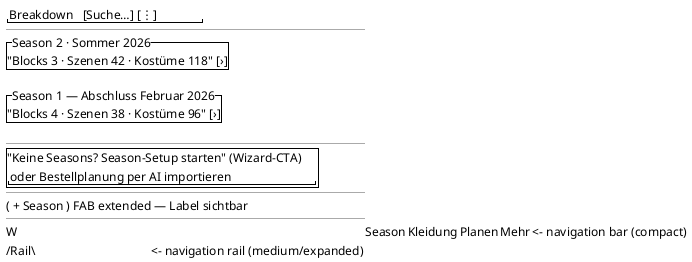

<!-- SPDX-License-Identifier: AGPL-3.0 -->
<!-- Copyright (C) 2024-2026 Breakdown RS Contributors -->
<!-- Co-authored-by: omen-alpha (opencode-go) -->

# Design Wireframes with PlantUML Salt

Author, modify, and review Salt wireframes and screen specs following the
project's text-based design workflow. Salt is the **mandatory layout
language** inside screen specs; it is platform-neutral (no Flutter
knowledge required — the same wireframes are the layout source for
Svelte/Slint/GPUI derivations).

## Inputs you must read first

- **Screen spec template:** `docs/design/screens/README.md` (the nine
  sections, the rule box, and the filled example).
- **Glossary:** `docs/design/glossary.md` — the single source for icon
  choices and German UI copy keys.
- **Existing screen specs** under `docs/design/screens/` — match their
  tone and structure; never fork the format.

## Workflow

1. **Read the template and the nearest existing screen spec.** New
   screen specs are created at `docs/design/screens/<screen-name>.md`
   (kebab-case) inside the OpenSpec change that implements the screen —
   never inside `openspec/changes/<change>/` (specs must survive
   archive).
2. **Fill all nine sections.** An inapplicable section states `N/A`
   with a reason; it is not deleted.
3. **Write the Salt wireframe** in the Layout section as a fenced
   PlantUML block (opening marker `plantuml` after three backticks,
   containing `@startsalt` … `@endsalt`). It documents static
   structure only (see acceptance criteria below).
4. **Check glossary conformance:** every visible label in the wireframe
   and in the Components & Semantics table uses a copy key and icon
   from `docs/design/glossary.md`. Navigation destinations and primary
   actions must show a *visible text label* alongside any icon — icon-
   only navigation is rejected at review.
5. **Validate compilation** before considering the spec done:
   ```bash
   scripts/check-design-diagrams.sh
   ```
   (runs PlantUML `-checkonly` over every fenced PlantUML block
   under `docs/design/`; zero exit = all blocks compile). Optionally
   check a single file during editing with the script's file arguments.
6. **Review checklist for modified specs:** no behavioral statements
   inside Salt; all nine sections present; platform-neutral component
   vocabulary (no Flutter widget names); copy keys resolve to glossary
   entries; diagrams compile.

## Sample Salt block

From the research report §4.2 target wireframe (Seasons home of the new
app shell). This is the reference for the wireframe dialect used in this
repository:


Salt syntax quick reference for the elements used above: `{^ … }`
grouped box (card), `[text]` button, `( )` radio, `|x|` toggle,
`|W|`/`/Rail\` navigation bar / rail, `[field____]` input,
`--` separator, `"…"` free text, `…` dotted row filler, `‹` inline icon
glyph.

## Acceptance criteria (normative)

- **Static-only rule (team decision 7):** Salt wireframes express
  component arrangement, grouping, and hierarchy — nothing else.
  Behavior, state transitions, timing, animation, and interaction
  details belong in the spec's States / Interactions Markdown sections
  and in tests. A wireframe comment claiming "on tap …" or "after 4 s
  …" is a review defect.
- **Visible-label rule:** every navigation destination and primary
  action renders a visible text label; icons reinforce only (glossary
  norm).
- **Compilability:** every fenced PlantUML block under `docs/design/`
  compiles via PlantUML `-checkonly` (CI gate
  `scripts/check-design-diagrams.sh` → `.github/workflows/docs-design-lint.yml`).
- **Platform neutrality:** generic M3 component vocabulary only;
  Flutter-specific details live in task lists and code.
